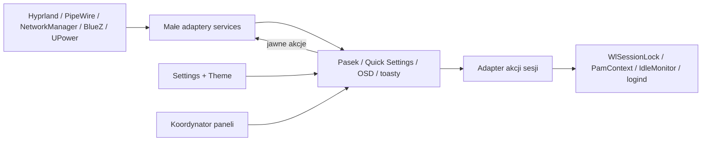

# Architektura Putkin

## Okna uwierzytelniania — 2026-09-20

AuthenticationService szereguje żądania askpass/Pinentry i zwalnia je po
wspólnym fade. AuthenticationBackend rejestruje natywny PolkitAgent oraz
IPC przekazujące wyłącznie ścieżkę prywatnego gniazda. AuthenticationSocket
obsługuje jeden klient, a PolkitRequest przekłada bieżący AuthFlow na model
widoku. AuthenticationHost tworzy jedną leniwą powierzchnię na monitorze
aktywnym przy otwarciu; blokada i utrata monitora anulują żądania.

Polkit rozpoczyna PAM od razu, dlatego nowe żądanie Polkit przy zajętym UI
jest odrzucane, zamiast skanować w tle innego okna. Nie uruchamiamy
dodatkowego PAM ani równoległego fprintd. Read-only API AuthFlow 0.3.1
udostępnia opis operacji, ale nie szczegóły nazwy aplikacji; kontekst nie
jest odgadywany. Pomocniki askpass.py/pinentry.py są krótkimi klientami,
bez dodatkowego demona. [Kontrakt](authentication.md).

Backend odczytuje timeout z systemowego pliku Polkit przez FileView,
bez zapisu i wywołań poleceń. Przekazuje jego wartość do PolkitRequest
przy rozpoczęciu rozmowy; NumberAnimation wylicza wyłącznie postęp
prezentacji. Natywny AuthFlow pozostaje źródłem gotowości pola hasła
i wyniku uwierzytelniania. Widok zachowuje stałą geometrię wiersza.

## Stała instalacja i uruchamianie

`scripts/install` / `_install.py` zarządzają kompletnymi katalogami runtime,
atomowym wskazaniem `current`, poprzednim buildem i retencją pięciu kopii.
Domyślny katalog Quickshella wskazuje `current`; jego stała ścieżka jest
jednocześnie tożsamością IPC. `scripts/qs` uruchamia ją przez UWSM jako
jedną usługę użytkownika w `session-graphical.slice`. Backend blokady
pozostaje w tym samym procesie. Aktualizacja nie zmienia plików aktywnego
buildu, a przełączenie jest dozwolone tylko po sprawdzeniu odblokowanej
sesji. Ustawienia i stan użytkownika pozostają poza paczką runtime.

## Screenshot — 2026-09-20

`ScreenshotService` zarządza fazami wybór → ukrycie → przechwycenie →
podgląd/zapis. Otrzymuje adapter, ekrany i stan blokady. `ActionController`
przekazuje okno/monitor sprzed launchera. `ScreenshotHost` tworzy leniwie
pełnoekranową nakładkę oraz osobny, pływający podgląd. `SelectionView` rysuje
cztery prostokąty przyciemnienia, obrys i systemowy celownik; bez bitmapy
oraz uruchamiania poleceń. Nowe przyciski używają wspólnego wejścia i fokusu.

`ScreenshotBackend` uruchamia pomocnik Python dopiero po zatwierdzeniu i
odmapowaniu nakładki. Nazwana reguła namespace wyłącza jej animacje
kompozytora; adapter aktualizuje ją przy starcie i odtwarza po reloadzie
Hyprlanda przez idempotentne `hl.layer_rule`.
`screenshot_backend.py` wywołuje grim oraz wl-copy, trzyma prywatny PNG
wyłącznie przez życie podglądu i zapisuje go dopiero na żądanie. Zamknięcie
sprząta plik, ale nie zabiera schowka. W spoczynku i podczas zaznaczania
nie ma procesu pomocniczego, timera cyklicznego ani przechwytywania obrazu.
[Kontrakt i retencja](screenshot.md).

## Natywna blokada i bezczynność — 2026-09-20

Jedna instancja Quickshell zawiera pasek, panele, `LockHost`, `LockService`,
`PamBackend`, `IdleService` i `IdleBackend`. Czysta logika Qt ma wstrzykiwane
adaptery; widok nie wykonuje poleceń. `WlSessionLock.secure` jest dowodem
zabezpieczenia ekranów. Pomocnik `session_backend.py` obsługuje logind,
ScreenSaver i deskryptor delay; hasło pozostaje w rozmowie PamContext.
Pliki PAM należą do wydania. Nie ma zależności Hyprlock/Hypridle ani drugiej
instancji shella. [Cykl życia i ograniczenia](session.md).

## Wspólne ikony Material Symbols — 2026-09-20

`core/Icons.js` dobiera symbole do stanu baterii, sieci, powiadomień oraz
identyfikatorów/kategorii aplikacji. `components/Glyph.qml` rysuje lokalne
ścieżki SVG przez Shape/PathSvg z pojedynczym fillColor. Rozmiar i padding
pochodzą z sekcji w `Metrics.iconSections`. Katalog może zadeklarować
szerszy viewport, który zachowuje wysokość i padding, zwiększając szerokość
pola. `IconLabel` łączy symbole z tekstem przy zachowaniu standardowych
kontrolek i wejścia Qt. Jedna ścieżka renderowania obejmuje pasek, tray,
launcher, suwaki, kafelki, menu, OSD i nagłówki powiadomień.

Topbar używa pola SVG 20 px, paddingu 6 px poziomo i 5 px pionowo.
`Glyph.slotHeight` uwzględnia pionowy padding sekcji; pozostałe sekcje
zachowują pola kwadratowe. `BarView.contentHeight` odejmuje dolny separator
2 px od wysokości 32 px. Wszystkie jego ikony,
łącznie z nadmiarem workspace/traya i oznaczeniem uwagi SNI, używają
`Theme.text`, tak samo jak Clock. Stan usług nie zmienia ich koloru.
Clock centruje `FontMetrics.tightBoundingRect(text)` względem baseline
w wewnętrznym Item, z zaokrągleniem do fizycznego piksela; kontrolka nadal
zarządza geometrią contentItem zgodnie z API Qt.

`scripts/update-icons` kompiluje niezmienione ścieżki Google. Dla sześciu
Charging … 2 dodaje viewport `[0,-880,960,800]`: korpus 400/800 ma taką samą
wysokość względną jak Android 480/960. `Glyph` skaluje jednorodnie według
wysokości viewportu i wylicza szerokość pola z jego proporcji. Na pasku
canvas rośnie z 20 do 24 px szerokości, a BatteryButton z 32 do 36 px,
z paddingiem 6/5 px. BarView używa implicitWidth baterii. Piorunek jest
częścią oryginalnej ścieżki po prawej, bez nakładania na Battery Android.
Usunięto osiem lokalnych wariantów z wewnętrznym piorunkiem i ich generator.

Usunięto renderer bitmap `ApplicationIcon`/Canvas, wybór Papirus-Dark i rozwiązywanie nazw
ikon przez backendy. SNI nadal odpowiada za identyfikację, status i akcje
aplikacji; jego bitmapy nie są wyświetlane. Załączniki obrazowe powiadomień
pozostają treścią wiadomości, nie ikonami UI. SVG są dołączone do wydania.

Signal używa `chat_bubble` w launcherze i przełącza się na `chat` w trayu
przy nieprzeczytanych wiadomościach. Signal Desktop 8.27.0 pozostawia SNI
w stanie Active i zmienia IconPixmap przez NewIcon; sam NeedsAttention
nie wystarcza. `SignalTrayState` obserwuje jawnie przekazane `icon`/status.
Niewidoczny Canvas 32 × 32 odczytuje czerwone oznaczenie w prawym górnym
rogu bitmapy wyłącznie po zmianie źródła; nie renderuje ikony użytkownika,
nie odpytuje cyklicznie i nie czyta wiadomości. Obsługuje też NeedsAttention.
Loader tworzy czytnik tylko dla Signala; poprzednie obrazy są zwalniane.
Widoczny symbol nadal rysuje `Glyph`, z tym samym kolorem i geometrią.

`NotificationService` jest właścicielem flag odczytu wpisów historii oraz
`unreadCount`. `NotificationFocus` przekazuje widoczność centrum ze wspólnego
koordynatora. Otwieranie centrum oznacza wpisy jako przeczytane, nadejście
w otwartym centrum nie zwiększa licznika, zamknięcie/akcja potwierdza odczyt.
Wygaśnięcie toasta zachowuje stan; zastąpienie wpisu po odczycie oznacza nowe
nieprzeczytane treści. Stan jest wspólny dla monitorów i wyłącznie sesyjny.

## Ramki kompozytora — 2026-09-20

`WindowAppearanceService` obserwuje końce ramki z `Theme`, neutralny
`border` oraz geometrię `Metrics`. Jawnie przekazany backend otrzymuje
zmianę po gotowości, podglądzie/zapisie/anulowaniu oraz reloadzie Hyprlanda.
`Qt.callLater` scala zmiany w jednej turze; identyczne wartości nie wysyłają
ponownie IPC. Bez pollingu, nowego procesu i poleceń w widokach.

`HyprlandAppearanceBackend` używa natywnego dispatchera Quickshell/Lua:
`function() hl.config(...) end`. Ustawia tylko ramki i promień narożników.
Shader Hyprlanda 0.56.2 waży oś y przez `sin(angle)`, x przez `1-sin(angle)`;
30° daje dokładnie pole `(x/w+y/h)/2` Shella. Dziesięć próbek sRGB ogranicza
różnicę jego interpolacji Oklab względem Qt. Końce zachowują ochronę
kontrastu `accentBorder` / `accentSecondaryBorder`. Dotyczy to również
ramek grup i ich zablokowanego stanu.

## Gradient grupy — 2026-09-20

`BarView`, `PanelSurface`, samodzielny toast i OSD oznaczają zakres przez
`accentScope`. `AccentCoordinates` czyta pozycje i rozmiary przodków
w wiązaniu QML, także przesunięcie `Flickable.contentItem`. Najbardziej
zewnętrzny zakres wygrywa: karta w centrum współdzieli gradient panelu,
a samodzielny toast ma własny. Zmiana geometrii, przewinięcie lub zmiana
akcentów aktualizuje wspólne współrzędne bez timerów i pracy co klatkę.
Proporcje grupy nie zmieniają udziału osi: pozycja koloru to
`(x / szerokość + y / wysokość) / 2`. Wektor Qt LinearGradient i kolor
drobnych glifów wynikają z tego samego pola. Prawy górny i lewy dolny
róg pozostają w połowie palety również w niskim, szerokim pasku.

`AccentGradient` definiuje przekątną i dwa tokeny koloru. `AccentRectangle`
zachowuje API Rectangle, a `QtQuick.Shapes` rysuje wypełnienie i pierścień
obramowania z przezroczystym wnętrzem. Nie wymaga efektów, dodatkowych
tekstur ani kompilowanych shaderów aplikacji. Drobne glify i uchwyty używają
koloru ze środka swojego położenia w grupie; kontrast tekstu wynika z tego
koloru. Oba końce ramki zachowują istniejącą ochronę kontrastu.
Kontrolki nadal używają standardowego wejścia Qt i `ControlInput`.

Aktywna ścieżka Shape zachowuje nieprzezroczysty `fillColor`; przezroczysty
kolor bazowy pomijał geometrię gradientu w lokalnym rendererze GPU Qt 6.11,
choć działał w software. Wnętrze ramki wycina osobna ścieżka OddEvenFill.
Menu traya nadaje pierwszy fokus dopiero po utworzeniu wszystkich delegatów
Repeatera; `itemAdded` uruchamia istniejącą naprawę, bez nowego timera.

## Quick Menu i centrum — 2026-09-19

`QuickSettingsView` tworzy tylko przełączniki radia. `NetworkView` i
`BluetoothView` w `modules/network` oraz `modules/bluetooth` korzystają
z istniejących usług i mają własne panele tego samego koordynatora.
Skanowanie należy do widocznego NetworkSection; zamknięcie lub zmiana
panelu zwalnia lease. Kafelki Quick Menu nie tworzą list ani skanowania.

`NotificationService.history` jest ograniczoną do 100 rekordów pamięcią
sesji. Rekord ma osobny klucz i ograniczoną kopię tekstu, bez natywnych
obiektów akcji i obrazów. Żywe akcje centrum odwołują się wyłącznie do
istniejącego NotificationEntry; po zamknięciu protokołu pozostaje tekst.
Transient także trafiają do historii; wygaśnięcie zwalnia natywny obiekt. `NotificationCenter` współdzieli
NotificationCard i okno PanelHost; stabilne klucze zachowują fokus przy
nowych wpisach, a zniknięcie akcji przywraca go z zachowaniem źródła wejścia.
DND jest wspólny dla kafelka Quick Menu i przełącznika w centrum. Błędy nadal łączy wyłącznie `ErrorNotifications`.

Wiersz audio używa wspólnego FocusIndicator dla suwaka i przycisków.
Slider może oddać rysowanie ramki grupie przez `drawFocus: false`.
Natywne wejście myszy i powód fokusu pozostają w ControlInput.
Jasność i temperatura używają tej samej zasady: FocusIndicator należy
do Item obejmującego cały wiersz, a suwaki mają `drawFocus: false`.

## Caffeinate i kafelki — 2026-09-20

`ToggleTile` współdzieli Button/ControlInput/FocusIndicator. QuickSettingsView
układa pięć przełączników w Grid, oddzielnie od trzech akcji stopki.
NightLightSection zawiera wyłącznie suwak widoczny dla potwierdzonego on.
CaffeinateService dostaje jawnie backend; widok nie uruchamia poleceń.
CaffeinateBackend uruchamia jeden pomocnik Python tylko na czas włączenia.
Pomocnik posiada FD logind, zmienia tryb nabywając nowy przed zwolnieniem
starego. EOF, reload i zakończenie procesu zwalniają FD. Brak timera
odpytywania i procesu pomocnika przy wyłączonej funkcji. Błędy odbiera
istniejący ErrorNotifications. [Pełny kontrakt](caffeinate.md).

## Decyzja

Jeden proces Quickshell, mały korzeń kompozycji, jawne adaptery domen i niezależne widoki. Systemowe usługi zachowują własność sprzętu i sesji. Własny daemon lub plugin C++ wymaga wykazania konkretnej luki API i nie jest warunkiem uruchomienia minimalnego paska.



Adaptery QML porządkują odpowiedzialności, ale nie dają izolacji awarii procesu. Błąd natywnej biblioteki może zakończyć cały shell. Osobne procesy dodajemy tylko tam, gdzie granica jest potrzebna, np. sprawdzony zewnętrzny locker.

## Proponowany podział

Strukturę tworzyć przy implementacji, gdy pojawia się pierwszy użytkownik danego elementu. Nie tworzyć pustego frameworka wszystkich przyszłych funkcji.

```text
shell.qml                  # składanie współdzielonych usług i widoków
core/                      # Theme, Metrics, Settings, koordynator paneli
components/                # Button, IconButton, Slider, PanelFrame, pola
services/                  # adaptery Hyprland, Audio, Brightness, Network…
modules/
  bar/                     # jeden pasek na monitor
  quicksettings/           # jeden panel, rozwijane sekcje
  settings/                # wygląd i zapis ustawień
  osd/
  notifications/
  power/
config/                    # przykład ustawień i opcjonalne integracje
assets/                    # faktycznie użyte zasoby
scripts/                   # kontrola środowiska, testy, dev, instalacja
tests/                     # testy zachowania i kontrolowane atrapy
docs/                      # specyfikacja, prompty i dowody odbioru
```

## Własność stanu i zależności

Rozszerzenie Klawiatura: `KeyboardSettings` ma oddzielny atomowy plik,
`KeyboardBackend` obsługuje rejestrację uchwytów Lua przez jednorazowy helper,
a `ActionController` współdzieli wykonanie między launcherem i skrótami.
Katalog jest zamknięty, widoki dostają modele jawnie. Host wybiera
`SettingsWindow` (natywny toplevel) dla ustawień, `InteractivePanelWindow`
dla popupów; przełączenie zwalnia poprzedni obiekt. `SettingsFocus`
przywołuje wyłącznie okno bieżącego procesu. [Kontrakt](keyboard.md).

- Każda domena ma jednego właściciela na proces, współdzielonego przez wszystkie monitory. Do widoków przekazywać adapter przez jawne właściwości. Nie tworzyć kopii AudioService dla paska, panelu i OSD.
- `Button`, `Slider` i `TextField` współdzielą `ControlInput`: pasywny
  `TapHandler` na kontrolce rozpoznaje kliknięcie, a `Keys.forwardTo`
  obserwuje klawisz przed obsługą widoku i Qt, bez jego akceptowania.
  Aktualizowany jest wyłącznie powód fokusu, także gdy element pozostaje
  ten sam; pola tekstowe nie są przy tym rozfokusowywane. Własne tła używają
  `FocusIndicator`, który wymaga aktywnego fokusu i powodu klawiaturowego.
  Otwieranie paneli, zmiany strony i podmenu przekazują powód wywołania.
- `Theme`, `Metrics` i `Settings` mogą być małymi singletonami. Usługi domenowe mogą być obiektami tworzonymi w korzeniu; istotne są pojedyncza instancja, jawna własność i możliwość podmiany w testach.
- `services/` nie importuje komponentów ani widoków. Nie otwiera samodzielnie paneli. Wynik akcji i błąd wracają jako stan lub sygnał.
- Każdy adapter wystawia potrzebny stan, dostępność oraz jawne metody. `busy`/błędy/capabilities dodawać tam, gdzie funkcja tego potrzebuje. Nie tworzyć uniwersalnego frameworka usług.
- Przyciski, suwaki i layout nie uruchamiają poleceń systemowych. Komendy trafiają do adaptera.
- Model urządzeń zachowuje tożsamość obiektów. Nie przebudowywać całej listy i fokusu przy każdej zmianie poziomu sygnału lub baterii.

## Okna, monitory i cykl życia

- `Variants` tworzy pasek dla każdego `Quickshell.screens`. Panel otrzymuje konkretny obiekt monitora i element wywołujący.
- Minimalny koordynator przechowuje identyfikator aktywnego panelu, monitor i dane potrzebne do otwarcia. Domyślnie jeden interaktywny panel na cały shell; power menu, overflow i menu traya zastępują inne panele. Podmenu traya należy do tej samej aktywnej rodziny menu. OSD i toasty mają własny cykl życia.
- Stan wewnętrznej sekcji Quick Settings należy do panelu. Koordynator nie zna list VPN, odpowiedzi na powiadomienia, tracków audio ani urządzeń BT.
- Ciężkie okna tworzyć na żądanie. `LazyLoader` nadaje się także do obiektów niebędących `Item`; `Loader` do poddrzew `Item`. Zamknięcie po krótkim przejściu zwalnia obiekt. Nie odczytywać `LazyLoader.item` podczas ładowania, jeśli wymuszałoby to blokowanie. [API LazyLoader](https://quickshell.org/docs/v0.3.1/types/Quickshell/LazyLoader/).
- Po usunięciu monitora panel się zamyka i zwalnia fokus. Przy otwarciu przez IPC wybierany jest monitor skupiony przez kompozytor, z opisanym fallbackiem.
- Bar nie przechwytuje stale klawiatury. IPC umożliwia wejście w nawigację paska. Podstawowy kontrakt jest vimowy: `h/j/k/l` oznaczają lewo/dół/góra/prawo, `Enter` potwierdza wybraną pozycję; `Escape` cofa/zamyka. Dotyczy również paneli i menu, zgodnie z [regułami nawigacji](design.md#nawigacja-klawiaturą). Obsługa działa w aktywnej powierzchni, z zachowaniem wpisywania liter w polach tekstowych i dodatkowego wejścia Qt. OSD i toasty nie kradną fokusu.
- Skanowanie Wi-Fi/BT uruchamiane wyłącznie dla widocznej listy; zwalniać tylko własne żądanie skanowania, również przy błędzie i zniszczeniu widoku.

Zrealizowany kontrakt etapu 02: [panele, host, wyłączność i fokus](panels.md).
`PanelHost` otrzymuje loader jawnie: Quickshell `LazyLoader` w produkcji
i podglądzie, adapter `QtQuick.Loader` w QtTest. Koordynator i widoki nie
importują Quickshella ani Hyprlanda. Natywny grab i layer-shell należą
wyłącznie do hostowanego `InteractivePanelWindow`.

Etap 04: [audio i OSD](audio.md). `AudioService` otrzymuje `PipewireBackend`,
a widoki wyłącznie ten jeden model domeny. `OsdHost` dostaje usługę i loader;
`LevelOsd` przyjmuje poziom, etykietę i ikonę. Osobne `OsdWindow` nie ma
fokusu ani wejścia. QtTest używa tego samego serwisu i widoków z
`MockAudioBackend`; test natywny uruchamia prywatny PipeWire wyłącznie
z wirtualnymi sinkami i rzeczywistym trackerem.

Etap 05: [jasność](brightness.md). Jeden `BrightnessService` szereguje
żądania do `BrightnessBackend` z `Process`, ogranicza zapisy do jednego
na 120 ms i publikuje stan po odczycie potwierdzającym. `PanelHost`
odświeża usługę przy otwarciu Quick Settings. Nie ma okresowego odpytywania.
OSD ma neutralne właściwości poziomu, etykiety, ikony i koloru oraz typ
audio/jasność; nadal istnieje tylko jeden host i loader.

Etap 06: [bateria i tray](battery-tray.md). `BatteryService` interpretuje
DisplayDevice z `UPowerBackend`; nie wybiera urządzeń peryferyjnych.
Zdarzeniowy gdbus i odczyt busctl po utracie właściciela uzupełniają
potwierdzoną lukę cyklu życia natywnego UPower 0.3.1. Brak pollingu.
`TrayService` przekazuje natywny model SNI, a `TrayMenuAdapter` tworzy
`QsMenuOpener` wyłącznie dla otwartej rodziny menu. Koordynator obsługuje
`trayOverflow`/`trayMenu`; ten sam host i maska wejścia ograniczają menu do
monitora przycisku. Otwieracze podmenu są zwalniane przed rodzicami.

Etap 07: [sieć i Wi-Fi](network.md). Wspólny `NetworkService` przekazuje
natywne modele z `NetworkBackend`. Widoczna lista ma `NetworkScanLease`;
pasek jest wyłącznie konsumentem stanu. PSK trafia tylko do natywnego API.
Zdarzeniowy monitor właściciela NM i typowany zapis/odczyt boolean radia
uzupełniają udokumentowane luki 0.3.1. Restart NM wymaga restartu procesu
Putkin; UI ukrywa stare dane. Brak nowych trwałych ustawień i IPC.

Etap 08: [Bluetooth](bluetooth.md). Jeden `BluetoothService` zachowuje wybór
adaptera i aktualizuje model sparowanych urządzeń bez resetowania delegatów.
`BluetoothBackend` korzysta z natywnych obiektów Quickshell.Bluetooth;
trzy typowane operacje D-Bus uzupełniają brak wyników żądań w QML 0.3.1.
Lista nie uruchamia discovery. Opcjonalny Blueman otrzymuje parowanie
w osobnym oknie. Utrata BlueZ ukrywa stare dane i wymaga restartu procesu.

Etap 09: [powiadomienia](notifications.md). Jeden natywny `NotificationServer`
powstaje po preflight właściciela D-Bus. `NotificationService` ogranicza
widoczne/oczekujące obiekty i wybiera monitor. `NotificationWindows`
ładuje potrzebne okna; `NotificationFocus` koordynuje świadome wejście
klawiaturą z panelami i paskiem. `notification-watch.py` uzupełnia dwie
zweryfikowane luki API zastąpień 0.3.1, przekazując do QML ograniczone
metadane bez obrazów i body. Jest jednym dzieckiem Quickshella, zwalnianym
przy reloadzie/zakończeniu; nie rejestruje serwera ani nie wykonuje akcji.
Bez trwałej historii, nowych pól settings.json i okresowego odpytywania.

Etap 10, po migracji: [sesja, blokada i bezczynność](session.md).
`SessionService` szereguje żądania i oddziela spóźnione odpowiedzi.
`LockService` przyjmuje tylko bieżący sukces PAM przy secure; przygotowanie
snu wstrzymuje uwierzytelnianie. IdleMonitor respektuje inhibitory Waylanda,
D-Bus i logind. Auto-reload jest wyłączony podczas blokady. Awaria procesu
pozostawia sesję zabezpieczoną przez kompozytor, ale może usunąć formularz.
`SessionController` odświeża jasność po wznowieniu; `IdleService` przywraca
DPMS i jasność sprzed przyciemnienia. Power pozostaje stroną wspólnego panelu.

Etap 11: [pulpit i Night Light](desktop.md). `WallpaperService` jest
wspólnym źródłem lokalnej ścieżki; `WallpaperWindows` tworzy opcjonalną
warstwę Background per ekran. Nie ma programu hyprpaper ani dodatkowego
procesu tapety. Jeden `NightLightService` i `NightLightBackend` komunikują
się ze zweryfikowaną usługą użytkownika hyprsunset 0.4.0. Krótki pomocnik
Python sprawdza właściciela i wersję przed IPC, szereguje zapis z odczytem
potwierdzającym i kończy pracę. Nie uruchamia/nie zatrzymuje demona;
brak stałego pollingu i nowych trwałych ustawień.

## Ustawienia

Jeden plik `${XDG_CONFIG_HOME:-$HOME/.config}/putkin/settings.json`, osobno od źródeł i zainstalowanego kodu. Minimalny model: `schemaVersion` i dwa akcenty; kolejne pola dopiero wraz z funkcją.

Walidacja przed zastosowaniem i zapisem. Odczyt z poprawnymi wartościami domyślnymi; ostatni poprawny stan pozostaje dostępny po błędzie odczytu. Podgląd edycji jest oddzielony od utrwalonego stanu. Zapis atomowy, obsługa `saved`/`saveFailed`, bez pętli zapis–reload–zapis. `FileView` oferuje atomowe zapisy i sygnały zmian; samo `watchChanges` wymaga obsługi przeładowania. [API FileView](https://quickshell.org/docs/v0.3.1/types/Quickshell.Io/FileView/).

Pierwszy zapis tworzy brakujący katalog aplikacji. Każda ścieżka zamknięcia edytora bez udanego zapisu odrzuca roboczy podgląd; reload również nie utrwala go przypadkiem. Konflikt zewnętrznej edycji podczas otwartego formularza nie może po cichu nadpisać cudzych zmian. Starsza aplikacja nie przepisuje pliku z nieznaną, nowszą wersją schematu. Nie kopiujemy kilkudziesięciu ustawień starego projektu.

Zrealizowany [kontrakt etapu 03](settings.md): jedna instancja czystego Qt
`Settings`, jawny `SettingsFile` z FileView oraz wiązanie `Theme.appearance`
do `Settings.effective`. Koordynator otrzymuje model, rozpoczyna edycję
i odrzuca ją na wszystkich ścieżkach zamknięcia, niezależnie od loadera.
FileView 0.3.1 tworzy katalogi bez dodatkowego procesu. Odczyty i zapisy są
szeregowane, zapis ma porównanie aktualnej treści oraz kontrolny odczyt
po `saved`. Własne watch/reload nie zapisują pliku. Ograniczenie wyścigu
z niezależnym pisarzem opisano w kontrakcie; FileView nie udostępnia CAS.

## Integracje

Punktem odniesienia jest zainstalowany podczas audytu **Quickshell 0.3.1**. [Lista modułów tej wersji](https://quickshell.org/docs/v0.3.1/types/) zawiera Hyprland, Networking, Bluetooth, Pipewire, UPower, SystemTray i Notifications. Każdy etap ponownie sprawdza faktycznie zainstalowaną wersję i jej dokumentację.

| Domena | Preferowany mechanizm | Granica pierwszej wersji |
| --- | --- | --- |
| Workspace i monitory | `Quickshell.Hyprland` | Bez analizy procesów terminala i własnego overview |
| Audio | `Quickshell.Services.Pipewire` i potrzebne trackery | Bez skryptów pollujących poziom i bez miksera aplikacji |
| Sieć | `Quickshell.Networking` | Ethernet, zapisane sieci, zwykłe Wi-Fi PSK; reszta w zewnętrznym edytorze |
| Bluetooth | `Quickshell.Bluetooth` | Radio, już sparowane urządzenia; agent PIN jako osobne rozszerzenie |
| Bateria / tray | `Quickshell.Services.UPower` / `SystemTray` | Żadnych fikcyjnych stanów przy braku urządzeń |
| Powiadomienia | Jeden `NotificationServer` | Toasty i DND, brak trwałej historii |
| Jasność | Mały adapter backlight + sprawdzone narzędzie, np. brightnessctl | Jeden wybrany backlight, odczyt przy starcie/akcji/otwarciu; DDC później |
| Blokada, bezczynność i zasilanie | WlSessionLock, PamContext, IdleMonitor oraz logind | secure przed sleep; hasła wyłącznie lokalnie w PAM; jedna instancja shella |

API Wi-Fi udostępnia połączenie z PSK dla odpowiednich typów zabezpieczeń; nie ma potrzeby pisać do tego własnego edytora C++. [WifiNetwork](https://quickshell.org/docs/v0.3.1/types/Quickshell.Networking/WifiNetwork/). BlueZ i NetworkManager pozostają właściwymi usługami systemowymi, do których moduły Quickshella się podłączają. [Networking](https://quickshell.org/docs/v0.3.1/types/Quickshell.Networking/), [Bluetooth](https://quickshell.org/docs/v0.3.1/types/Quickshell.Bluetooth/).

Każdy potrzebny `Process` ma listę argumentów, limit czasu, obsługę błędu i regułę kończenia. Długie operacje nie blokują UI. Dla jasności nie zakładamy, że obserwacja pliku sysfs niezawodnie dostarcza każdą zewnętrzną zmianę: etap 05 ma sprawdzić to na backendzie i opisać ograniczenie. Skróty jasności wywołują to samo IPC co suwak. Adapter z 05 udostępnia `refresh()`; etap 10 podłącza do niego zweryfikowane zdarzenie wznowienia sesji.

## IPC

Małe, udokumentowane API dodawane stopniowo, np. `ui toggleQuickSettings`, `ui openSettings`, `ui closePanels`, `bar focus`, `audio changeVolume`, `brightness change`, `session openPower`, `session lock`. Dokładne sygnatury ustala implementacja w `docs/ipc.md`.

IPC przyjmuje typowane dane i dozwolone akcje, nie dowolne polecenia powłoki. Nie przenosi haseł ani nie wymaga znajomości prywatnych identyfikatorów QML. Wywołania z konfiguracji Hyprlanda wskazują konkretną konfigurację Putkin.

## Testy i środowisko

1. Kontrola składni/importów i poprawnego przenoszenia kodu wyjścia do skryptu testowego. Sam `qmlformat` nie zastępuje testu załadowania QML ani testów zachowania.
2. Małe testy faktycznych kontraktów: zapis/reload ustawień, fokus i lifecycle paneli, błędy usług, kolejność lock/suspend. Atrapy wstrzykiwane przez te same interfejsy co prawdziwe adaptery.
3. Kontrolowany Wayland i prywatny D-Bus do integracji; osobne katalogi XDG. Widoki testowe nie importują pośrednio hostowego lockera ani usług sprzętu.
4. Testy sprzętowe i sesyjne raportowane osobno. Prywatny session bus nie izoluje system bus, PipeWire, urządzeń ani PAM. Test powiadomień nigdy nie przejmuje nazwy działającego serwera na pulpicie.
5. Najpierw testy odpowiednie do zmiany; pełniejszy odbiór w etapie 12. Nie zastępować zachowania testami sprawdzającymi obecność konkretnego tekstu w źródle.

Pomiar bazowy w etapie 00: warunki, wersje, liczba monitorów, 60 s bezczynności, RSS, CPU i liczba procesów potomnych. Powtórzyć po nowych stale działających usługach oraz przy odbiorze; po 20 otwarciach panelu sprawdzić trend pamięci i żywe zasoby. Nie narzucamy wyniku w MB/% bez bazowego pomiaru. Stały polling i wzrost pamięci wymagają wyjaśnienia.

Gotowość blokady pochodzi wyłącznie z `WlSessionLock.secure`. PID i przyjęcie IPC nie stanowią potwierdzenia. Testy PAM wymagają prywatnego stosu i zamaskowania systemowego katalogu; szczegóły w [kontrakcie sesji](session.md).

## Instalacja

Przenośna instalacja użytkownika, oddzielona od źródeł i ustawień. Skrypt ma tryb planu, staging, atomowe opublikowanie kompletnego runtime, kopię poprzedniej wersji i rollback. Nie wymienia plików działającej instalacji pojedynczo; zachowanie auto-reloadu przy podmianie wymaga sprawdzenia. Nie instaluje automatycznie pakietów i nie aktualizuje systemu. Przy brakach wyświetla konkretne wymagania.

Etap 13 przygotowuje i testuje wdrożenie w katalogu tymczasowym. Aktywacja na pulpicie jest ostatnim, opisanym krokiem z istniejącą autoryzacją użytkownika; samo zadanie napisania roadmapy jej nie uruchamia. Przełączenie serwera powiadomień musi zachować jednego właściciela `org.freedesktop.Notifications` i odwracalny powrót do poprzedniej konfiguracji.


## Korekta powierzchni i błędów

`ErrorNotifications` w korzeniu łączy jawnie przekazane źródła błędów
z `NotificationService.notifyError`. Usługi domenowe nadal nie importują
widoków i nie wywołują programów do powiadomień. Lokalne toasty działają
także bez właścicielstwa serwera D-Bus i w DND. Toast przechowuje kopię
wyświetlanych pól przez czas fade, po czym oddaje zasoby.

`FadeScope`/`FadeColumn` współdzielą `FadePresentation`: start po gotowej stronie
i dwóch niezmienionych aktualizacjach klatki, następnie opacity przez 200 ms
z InOutCubic. Warstwa obejmuje całe poddrzewo i margines fokusu; pozostaje
do końca widoczności, aby jej ponowne tworzenie nie dawało pustej klatki.
Zagnieżdżone sekcje wchodzą razem z rodzicem. Przy zamknięciu hosty odłączają
wejście natychmiast i zwalniają widoki po 200 ms. Bez opcji ograniczania ruchu.
Przygotowanie nie ma timera ani pracy klatkowej po zakończeniu otwierania.
Na Hyprland 0.56.2 interaktywny panel odnawia nadal uprawniony grab, gdy
zamknięcie biernej warstwy odebrało fokus. Faktyczne kliknięcie poza panelem
zamyka jego sesję, więc odnowienie nie przechwytuje wejścia innej aplikacji.

API sprawdzone w wersjach lokalnych: Qt 6.11.2, Quickshell 0.3.1,
Hyprland 0.56.2, Hyprlock 0.9.6 oraz Linux-PAM 1.7.2 (tylko atrapa testowa).
Oficjalne źródła: [Window](https://doc.qt.io/qt-6.11/qml-qtquick-window.html),
[grab](https://quickshell.org/docs/v0.3.1/types/Quickshell.Hyprland/HyprlandFocusGrab/),
[LayerSurface](https://github.com/hyprwm/Hyprland/blob/v0.56.2/src/desktop/view/LayerSurface.cpp),
[Hyprlock](https://github.com/hyprwm/hyprlock/blob/v0.9.6/src/config/ConfigManager.cpp).

## Launcher — rozszerzenie

Korekta podglądu 2026-09-20: `LauncherView` przekazuje wybraną pozycję do
`LauncherService.previewEntry`. Backend wysyła rewizję i ID do istniejącego
pomocnika; zadanie `preview_clipboard` dekoduje tekst lub adres data obrazu,
anulowane przy następnym wyborze i zamknięciu. Serwis odrzuca stare odpowiedzi
i usuwa treść po zamknięciu. Nie ma dodatkowego procesu stałego, pollingu
ani plików podglądu. Widok nadal nie wykonuje poleceń systemowych.

`PanelHost.surfaceWidth` zachowuje szerokość głównej listy; `surfaceExtentWidth`
dodaje dopasowany kwadrat podglądu. `PanelSurface` obejmuje oba obszary wspólnym
gradientem, a `LauncherPreview` dostaje jawnie serwis i widok listy. Natywna
maska `InteractivePanelWindow` łączy dwa prostokąty, z wyłączeniem przerwy
i obszaru pod krótszą listą. Jeden grab i jedno okno obejmują całość.

`LauncherService` i `LauncherBackend` są jedną współdzieloną parą.
Widok `modules/launcher/LauncherView.qml` korzysta z istniejącego PanelHost,
koordynatora i graba; `surfaceWidth` wybiera 640 px dla launchera i 360 px dla
pozostałych paneli. Czysty Qt serwis odrzuca spóźnione odpowiedzi po zmianie
zapytania oraz nie zamyka ponownie otwartego panelu po starej aktywacji.
Zdarzeniowy pomocnik Python obsługuje ograniczone fd, zapis MRU i dwa
watchery schowka. Stan, retencja, timeouty i wymagania: [launcher](launcher.md).

Komendy `:wN`/`:mwN` używają jawnie przekazanego, wspólnego
`WorkspaceService`. Launcher zapamiętuje natywne aktywne okno przed
otwarciem warstwy i przekazuje je do akcji. `HyprlandService` waliduje
żywą tożsamość oraz adres; wynik potwierdza zmiana natywnego workspace.
Nie dodaje procesu, odpytywania ani zależności widoku od Hyprlanda.

`LauncherIpc` otrzymuje również jawny `LauncherService`; `openClipboard`
i `openCommands` ustawiają filtr/prefiks po otwarciu wspólnego panelu.
Zmiana trybu unieważnia późną aktywację i przenosi fokus do pola tekstowego.

Rozszerzenie audio 2026-09-17: `AudioView` jest stroną tego samego PanelHost.
`AudioChannelService` i `PipewireChannel` współdzielą logikę poziomu,
wyciszania i potwierdzania urządzenia dla wyjścia oraz mikrofonu.
`AudioService` zachowuje stare API wyjścia i udostępnia `microphone`.
Oba kierunki korzystają z natywnego singletonu PipeWire, bez nowych procesów.

Rozszerzenie baterii 2026-09-17: `BatteryView` jest kolejną stroną jednego
PanelHost, zależną jawnie od BatteryService i PowerProfileService. Pierwszy
zachowuje UPower DisplayDevice; drugi ma jeden współdzielony adapter PPD.
Potwierdzenie zapisu i obserwacja właściciela uzupełniają konkretne luki
PowerProfiles w Quickshell 0.3.1, bez nowego daemona ani logiki systemowej
w widoku. [Kontrakt i sprawdzone API](battery-tray.md).
