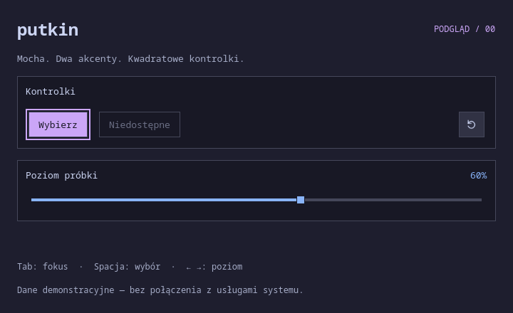

# Etap 00 — dowody odbioru

2026-09-16, czas lokalny Europe/Warsaw. Obraz pochodzi z Quickshell 0.3.1 /
Qt 6.11.2, `preview.qml`, renderer offscreen/software, skala 1, 720×440,
Noto Sans Mono (fallback). Dane są demonstracyjne.



Widać nieprzezroczyste tło, akcent Mauve, drugi akcent Blue, prostokątne ramki
i 2-pikselowy obrys fokusu poza przyciskiem. Zrzut obejrzano po wygenerowaniu.
Nie przedstawia paska ani aktywnego pulpitu.

## Pomiar 60 s

Źródło: [pełny JSON z 61 próbkami](00-idle-60s.json).
Zakończenie: `2026-09-15T23:11:32.655929+00:00`, czyli 16 września w Warszawie.

| Parametr | Wynik |
| --- | --- |
| Rozgrzewka / obserwacja | 2 s / 60.000275 s |
| Tryb | Offscreen, software, basic render loop, 720×440, skala 1 |
| Monitory | Jeden wirtualny ekran Qt; zero rzeczywistych wyjść Wayland |
| Stan | Statyczny podgląd, brak interakcji i wykonywania zrzutu |
| RSS start / koniec | 79 540 / 79 540 KiB (~77,68 MiB) |
| RSS min / średnia / max | 79 540 / 79 540 / 79 540 KiB |
| CPU shella | 0 przyrostu ticków, 0,00% jednego rdzenia przy rozdzielczości 10 ms |
| Procesy | 3 przez cały pomiar: `dbus-run-session`, prywatny `dbus-daemon`, `quickshell` |
| Dzieci Quickshella | 0 na początku i końcu |
| Izolacja | Prywatne XDG i session bus, bez adresów wyświetlacza/usług hosta |

Pomiar jest bazą porównania dla tego trybu, nie limitem zużycia pamięci
przyszłego shella ani pomiarem na pulpicie użytkownika.

## Polecenia odbioru

```sh
scripts/check
scripts/test
scripts/preview --screenshot docs/evidence/00-foundation.png
scripts/preview --root --screenshot artifacts/root.png
scripts/measure-idle --output docs/evidence/00-idle-60s.json
```

Zasady, znaczenie wyników i ograniczenia: [testing.md](../testing.md).

Wszystkie powyższe polecenia zakończyły się PASS. Bramka objęła 13 plików QML,
testy: 6 regresji Python i 5 zachowań Qt Quick (7 wyników z init/cleanup).
Zrzuty z `shell.qml` i `preview.qml` są identyczne bajtowo (SHA-256:
`524336995b1a59ae898b4fb6c1f0d7fe462045df435de7ac4f337a08bb9602e0`).
Po zakończeniu pomiaru potwierdzono brak jego procesów w `/proc`.
