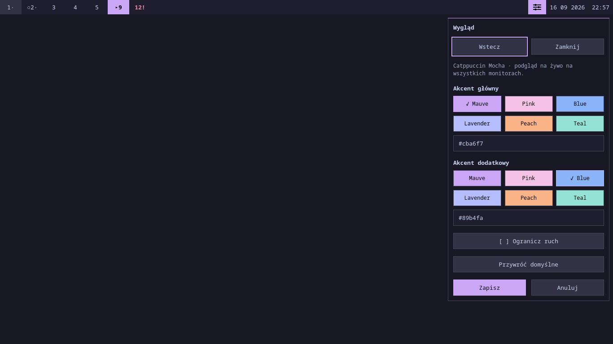
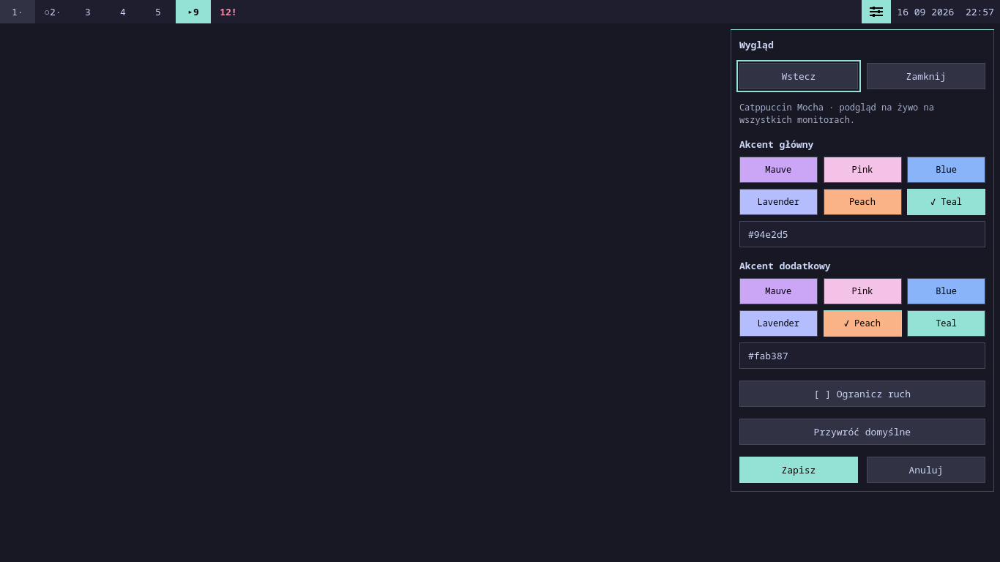

# Etap 03 — dowody wyglądu i trwałości

2026-09-16, Quickshell 0.3.1, Qt 6.11.2. Render offscreen/software,
prywatne XDG/D-Bus, rzeczywisty Settings/FileView i jawne atrapy pulpitu.
Żaden test nie uruchamia produkcyjnego shella na aktywnym pulpicie.

## Ten sam widok, dwa zestawy akcentów

Oba obrazy mają 1366×768 i tę samą scenę, fokus oraz datę. Obejrzano
pełny formularz, zaznaczenia próbek, pola HEX, przyciski i pasek.

Mauve/Blue:

Teal/Peach:

Dodatkowo: [bardzo ciemny i biały akcent](03-appearance-contrast.png)
— biały tekst na ciemnym wypełnieniu, jasny obrys, ostrzeżenie w formularzu;
[320×220](03-appearance-small.png) — panel mieści się w ekranie, reszta
formularza jest osiągalna przez przewijanie i nawigację fokusu.
Logi renderowania leżą obok PNG; wyłącznie znana diagnostyka maski offscreen.

## Wyniki

- `scripts/check`: **PASS**, 49 plików QML.
- `scripts/test`: **PASS**, 6 regresji Python, 67 wyników QtTest bez ostrzeżeń,
  natywny adapter na prywatnych socketach Hyprlang/Lua, IPC/LazyLoader
  z 20 cyklami i integracja ustawień. [Pełny log](03-tests.log).
- `scripts/test-settings-integration --output docs/evidence/03-settings.json`:
  **PASS**, 10 grup, w tym prawdziwe pliki, atomowe zapisy, restart, błędne
  dane, uprawnienia, konflikty bez watch, 20 zmian bez utraty panelu/fokusu/
  kursora oraz miękki/twardy reload. [Raport](03-settings.json),
  [log](03-settings.log). Trzy dokładne komunikaty inotify wynikają
  z celowego chmod(000) i pozostają widoczne.
- `scripts/measure-idle --panels --output docs/evidence/03-idle-60s.json`:
  **PASS**, 60 s, 0 zarejestrowanych ticków CPU, RSS 91 996 → 92 124 KiB,
  3 procesy środowiska, 0 dzieci shella. [Pomiar](03-idle-60s.json),
  [log](03-idle-60s.log). Pomiar obejmuje prawdziwe watchery ustawień,
  zamknięty panel, 30 workspace i zegar minutowy.

Wzrost RSS o 128 KiB w tej próbie nie stanowi trendu ani limitu pamięci.
Pomiary innych etapów były osobnymi procesami; nie przypisujemy różnicy
między startami wyłącznie modelowi ustawień.

## Granice odbioru

Nie ma `/dev/dri`, Westona, Sway ani Cage. Nie ponawiano znanej nieudanej
próby prywatnego Hyprlanda. Natywny layer-shell, grab, fokus aplikacji,
hotplug i mieszane skale pozostają niezweryfikowane. Test dwóch pasków
potwierdza współdzielenie Theme, nie fizyczne monitory. Ograniczenie
optymistycznej ochrony konfliktów opisuje [kontrakt ustawień](../settings.md).
Status: **gotowy do odbioru środowiskowego**, bez deklaracji pełnego odbioru.
