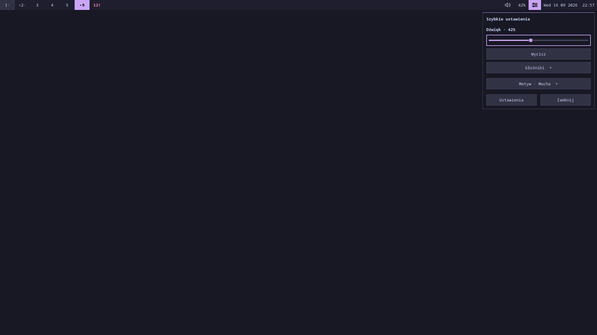
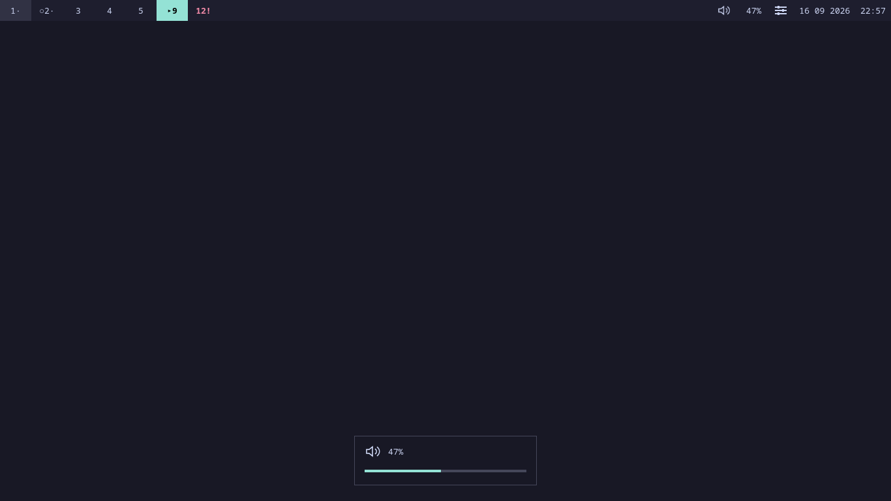
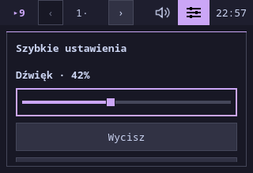
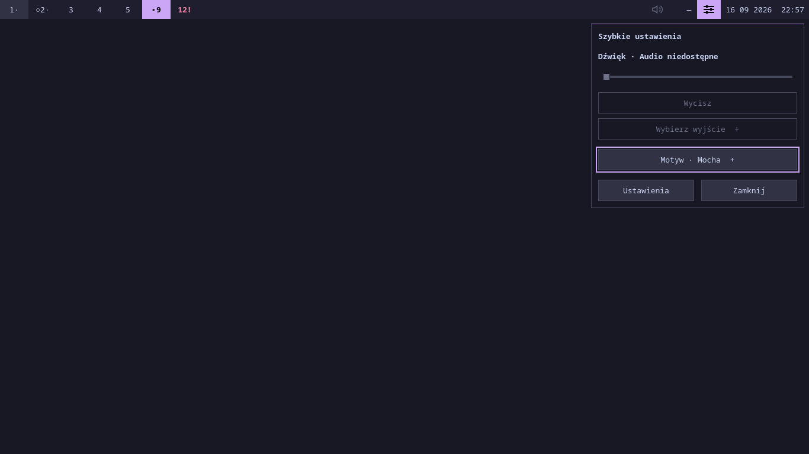

# Odbiór etapu 04 — audio i OSD

2026-09-16. Kod gotowy do odbioru środowiskowego. Natywne API audio
sprawdzono na prywatnym serwerze PipeWire z wirtualnymi wyjściami.
Nie zmieniano fizycznego audio i nie uruchamiano shella na pulpicie.

## Wyniki

| Sprawdzenie | Wynik / dowód |
| --- | --- |
| `scripts/check` | **PASS**, 61 plików QML, 0 błędów; [log](04-check.log). |
| `scripts/test` | **PASS**, 6 testów Python, 85 wyników QtTest, natywne IPC Hyprlang/Lua, panele, FileView i audio; [log](04-tests.log). |
| QtTest po końcowej ochronie fokusu | **PASS**, 85 wyników; [log](04-qt.log). |
| `scripts/test-audio-integration --idle --output docs/evidence/04-audio.json` | **PASS**, 20 cykli / 0 żywych OSD, 60 s spoczynku / 0 ticków CPU. [JSON](04-audio.json), [log Quickshell](04-audio.log), [log PipeWire](04-audio.pipewire.log). Liczby pomiaru w [statusie](../status.md). |
| Podgląd 1920×1080 | **PASS**, panel i pasek ze wspólnym poziomem 42%, wyraźny fokus suwaka. |
| Podgląd 1366×768 | **PASS**, OSD 47% z akcentem Teal; pasek pokazuje ten sam poziom. |
| Podgląd 320×220 | **PASS**, panel ograniczony do ekranu, dalsze kontrolki dostępne przewijaniem/klawiaturą; pasek zachowuje workspace, audio, Quick Settings i zegar. |
| Brak usługi | **PASS**, etykieta niedostępności i kreska w pasku, nieaktywna regulacja, fokus na dostępnej kontrolce. |

Zrzuty zostały otwarte i obejrzane. Offscreen używa Noto Sans Mono,
skali 1 i renderera software. Podgląd ma jawne atrapy monitorów i audio.

## Pokrycie i ograniczenia

Testy obejmują walidację, serię przyrostów, błędy operacji, timeout,
zmiany zewnętrzne, wybór rzeczywisty/preferowany, utratę wyjścia, późniejszy
start i restart serwera, soft/hard reload, monitory na atrapach, odnowienie
OSD, zwolnienie loadera i brak zmiany aktywnej kontrolki przez widok OSD.
Osobny odczyt trackera po komendzie jest sprawdzany na realnym PipeWire,
nie tylko na deklaratywnej atrapie. Dwadzieścia cykli kończy się zerem
żywych OSD. Szczegóły: [testy](../testing.md#10-audio-prywatny-pipewire-i-osd--etap-04).

W toku testów poprawiono utratę sumowania szybkich strzałek przy opóźnieniu,
pętlę Tab po usunięciu wszystkich wyjść, odzyskiwanie fokusu wyłączonego
suwaka i ochronę fokusu innych kontrolek. Poprawiono także deklarację
zależności IPC oraz rozwiązywanie ścieżki ikony przez wspólny widok OSD.
Nie wyciszono diagnostyk importów ani błędów QML.

**Niewykonane:** fizyczne urządzenia i polityka WirePlumber, warstwy Waylanda,
przepuszczanie kliknięć przez OSD, brak przejęcia fokusu innej aplikacji,
fizyczne monitory/hotplug i mieszane skale. Bez prywatnego kompozytora
nie oznaczamy tych kryteriów jako zaliczonych. Nie przechodzono do etapu 05.
