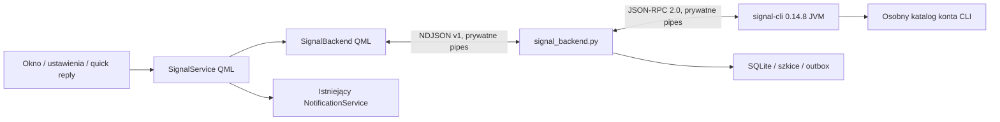

# Signal — kontrakty po audycie S00

## S12 — kontrakt wydania i danych

Wydanie zawiera przypięte `dependencies/signal/{cli,jre}`. Pełne drzewo
binarek i prawa wykonania są weryfikowane SHA-256, oprócz sprawdzanych już
dwóch jarów retencji. Backend wybiera narzędzia ze swojego wydania;
instalator nie zapisuje ścieżek do narzędzi w preferencjach użytkownika.

`services/signal-release.json` deklaruje zakres migracji 0–7, docelowy
reader v7, `cliStore=signal-cli-0.14.8`, retencję 2. Sprawdzana jest
zgodność tej deklaracji z kodem Store oraz pinami CLI. Prywatny
`putkin/signal/release.json` powstaje pod lease przed migracją/otwarciem
CLI. Jest minimalnym kontraktem danych, zachowywanym przy rollbacku.

Instalator sprawdza zgodność przed zatrzymaniem i ponownie pod lease po
stopie. Odczytuje schemat z kopią WAL, bez tworzenia SHM w danych celu.
Niezgodny reader/format CLI/retencja blokują przełączenie, również
automatyczny powrót po częściowo wykonanej migracji. Nie przywraca się
bazy, kluczy, cache ani treści usuniętych/znikłych. Powrót do shella bez
Signala zachowuje dane i wyłącza odbiór. Limit pięciu buildów nie obejmuje
katalogu danych. [Obsługa i dokładne polecenia](OPERATIONS.md).

Scalenie z `main` 311edb8 zachowuje aktywne uwierzytelnianie, launcher,
komendy sesji i rozwijane karty powiadomień. Karta Signala nadal używa
pełnego adresu rozmowy oraz wspólnej retencji i osobnego szkicu odpowiedzi.
Centrum korzysta ze wspólnego zewnętrznego przewijania; testowe okna
otrzymały odpowiednie kontenery po tej zmianie kontraktu shella.

Stan funkcji po S11: 2026-09-21. **Proces, transport, SQLite, historia, outbox,
parowanie, okno wiadomości, powiadomienia z quick reply, receipts/read sync
oraz media, reakcje, edycje, cytaty, wzmianki, pisanie, usuwanie, retencja,
profile/kontakty i zarządzanie grupami są zaimplementowane lokalnie.** Wersja i dowody API:
[API.md](API.md), [wyniki S01](STATUS.md#s01--proces-usługi-i-transport--2026-09-20).

## Układ okna po odbiorze S12 — 2026-09-21

Ramka okna należy wyłącznie do Hyprlanda. „Szczegóły” są po prawej
stronie nagłówka rozmowy i zawierają kontrolkę znikania. Menu wiadomości
jest w prawym górnym rogu dymka, w linii pierwszego wiersza treści;
kropki i reakcje są bez tła/ramki, w kontrastowym kolorze tekstu.
Dolny wiersz łączy reakcje po lewej
z godziną i stanem po prawej. Własne dymki korzystają z bieżącego akcentu
i dopasowanego koloru tekstu. Composer ma początkowo wysokość przycisków
(36 px); rośnie tylko wraz z tekstem, maksymalnie do 144 px.
Zmiana geometrii zachowuje kotwiczenie historii, klawiaturę i operacje
wiadomości. [Projekt](../design.md#okno-wiadomości--2026-09-21).

Załącznik w rozmowie ma klikalną miniaturę lub symbol typu; nazwa,
rozmiar i działania Zapisz/Otwórz/Zamknij są dopiero w podglądzie.
Enter także otwiera podgląd, a zamknięcie przywraca fokus miniatury.
Plik bez obsługi podglądu nadal można zapisać lub otworzyć z tego widoku.

## Odporność i pomiary — S11

[ACCEPTANCE.md](ACCEPTANCE.md) rozdziela domenę/atrapy, lokalny JVM,
Qt offscreen, prywatny Wayland oraz niewykonane próby live S12.
Hotplug: sygnały geometrii usuwanego QScreen nie uruchamiają natychmiast
przeliczania powiadomień; `Qt.callLater` pozwala najpierw zaktualizować
listę ekranów. Historia odłącza model przed pełnym resetem, aby anulować
inkubowane delegaty przed usunięciem ich indeksów.
Testy wejścia czekają na zakończenie fade, nie tylko przydzielenie fokusu.
Pomiar stron obejmuje 10 000 syntetycznych wiadomości, 60 s spoczynku
z zamkniętym oknem i 20 cykli. Paginacja backendu ma 50 rekordów/stronę;
UI może pokazać mniej po redakcji bieżącej generacji. Jest to prawidłowe
usunięcie treści, nie powód ponownego pobierania/usuwania kursora.
Nie zmieniają się gwarancje ACK, unknown, retencji i tożsamości odbiorcy.

## Grupy, kontakty i akceptacja — S10, 2026-09-21

SQLite **v7** dodaje directory_operations, conversation_preferences i
directory_avatars. CLI pozostaje przypięty do putkin-retention-2.

- Tożsamości rozmów pozostają konto + ACI albo groupId. Nazwa, numer,
  username, profil i avatar to prezentacja, nigdy klucz łączenia historii.
  Odświeżenia aktualizują wybraną rozmowę i autorów bez resetowania historii
  ani szkicu. Wybór kontaktów do grupy jest zbiorem ACI, nie indeksów listy.
- Nowa rozmowa obejmuje kontakty, profile, rozwiązywanie numeru/username,
  katalog grup (także zaproszeń bez wiadomości), tworzenie i dołączanie.
  Rozwiązanie użytkownika nie wysyła testowej wiadomości. Istniejący pending
  nie staje się zaakceptowany od samego otwarcia.
- Własna Notatka, lokalnie zainicjowana nowa rozmowa i kontakt z odczytanym
  profileSharing mają prawo odpowiedzi. Nieznany incoming ma pending:
  bez mark-visible/read queue, pisania, odpowiedzi i mutacji do akceptacji.
  Numery bez ACI pozostają nierozwiązane i nie dostają automatycznego read.
  Akceptacja przechodzi przez API i readback; granica potwierdzenia sync
  jest jawnie opisana w [API](API.md#grupy-i-kontakty--s10-2026-09-21).
- Grupa rozróżnia member/invited/requesting/left/terminated/unknown.
  Brak członkostwa, blokada i terminated wyłączają composer oraz quick reply
  w dotychczasowych kartach. Wysyłanie, edycje/reakcje/usuwanie i odczyt
  ponownie sprawdzają dostępność w bridge. Grupa z wysyłaniem tylko dla
  adminów nadal pozwala członkowi odczytać wiadomości.
- Administracja wymaga pełnego snapshotu uprawnień. Edycja szczegółów,
  dodawanie, role, zaproszenia/prośby, uprawnienia, link i opuszczenie mają
  osobne warunki. Backend odświeża je przed mutacją. Usunięcie osoby,
  odebranie roli, odmowa, reset linku, blokada i opuszczenie wskazują cel
  i wymagają potwierdzenia; fokus zaczyna na Anuluj. Ostatni administrator
  z innymi członkami wybiera następcę.
- UUID operacji grupy trafia do SQLite **przed** wywołaniem CLI. Ponowne
  wywołanie z tym samym ID zwraca stan, a zmieniony payload jest konfliktem.
  Restart sending → unknown; utrata odpowiedzi lub RPC error nie dowodzi,
  że grupa nie powstała. Nie ma automatycznego ponowienia. Late result
  aktualizuje tę samą operację. Partial zachowuje prawdziwy groupId i błąd
  częściowej dystrybucji; nie zmienia go w pełny sukces.
- Unknown create blokuje kolejne tworzenie. Rekoncyliacja odczytuje katalog
  i pokazuje różnicę względem listy sprzed próby. Nie przypisuje grupy po
  samej nazwie: użytkownik jawnie wybiera istniejący ID. Znany target
  otrzymuje readback; przyjęcie bieżącego stanu nie dowodzi doręczenia
  zmiany wszystkim członkom. Nierozstrzygnięta zmiana danej grupy blokuje
  jej kolejne mutacje do rozstrzygnięcia.
- Zmiany składu/nazwy/opisu/uprawnień tworzą lokalny wpis kind=system,
  bez tekstu, autora, unread, toasta i sieciowego send. To obserwacja różnicy
  kolejnych snapshotów, nie kompletny audyt serwera ani odtworzona historia.
  Wiadomości grup zachowują autorów, wersje, cytaty, wzmianki, media,
  reakcje i rzeczywiste raporty per osoba z S06–S09.
- Ukrycie oraz wyciszenie są **lokalne** i niezależne od block/unblock,
  globalnego DND i innych aplikacji. Nie zatrzymują odbioru, zapisu, unread
  ani retencji. Ukryte rozmowy można ponownie wyświetlić z listy.
- Katalog jest odświeżany na zdarzeniach i żądaniu; brak okresowego pollingu.
  Readbacki są serializowane i scalane. Mutacje grup, wysyłka i read receipts
  współdzielą blokadę obejmującą preflight i dispatch. Anulowanie transportu
  nie może połknąć zatrzymania sendera przy wyłączeniu konta.
- Avatar jest lokalną miniaturą JPEG z walidacją dekodera, rozmiaru i MIME.
  Cache ma limit 32 MiB; zastąpienie usuwa poprzednią kopię. Startup usuwa
  niepowiązane i porzucone pliki; wyczyszczenie lokalnej historii usuwa cache.
  Input niepewnej mutacji pozostaje do zakończenia procesu/ponownego startu.
  QML dostaje tylko prywatny URL. Nie ma pobierania arbitralnych URL profilu.

## Usuwanie i retencja — S09, 2026-09-21

Ta sekcja zastępuje ograniczenia retencji opisane w historycznych sekcjach
S02–S08. SQLite **v6**, IPC nadal **v1**; CLI **0.14.8 JVM +
putkin-retention-2**, sprawdzane oba jary. Wygaśnięcia nie są obliczane od
nadejścia wiadomości. Dawne placeholdery `expiring_unsupported` nie odzyskują
niezapisanej treści.

- „Usuń u mnie” działa tylko w Putkinie, bez RPC. Rekord znika z paginacji;
  minimalna tożsamość i tombstone zapobiegają replay. Brak potwierdzonego
  delete-for-me sync w wybranym API; nie zmieniamy historii telefonu.
- „Usuń u wszystkich” jest mutacją `remoteDelete` we wspólnej kolejce:
  własny autor, potwierdzone wysłanie, mniej niż 24 h od pierwotnej wersji,
  dostępna rozmowa. Backend ponownie sprawdza warunki przed dispatch.
  Żądanie nie gwarantuje usunięcia cudzych kopii. Definitywna odmowa może
  mieć jawne retry; partial/unknown nie są automatycznie ponawiane.
- Usunięcia przychodzące i sent sync wiążą rozmowę, autora i timestamp
  wersji. Znane krawędzie edycji są domykane w obu kierunkach, także bez
  wiadomości bazowej. Tombstone jest trwały, bez body/emoji/cytatu; nie ma
  TTL pozwalającego wskrzesić usuniętą treść. Czyści go dopiero osobna
  istniejąca operacja wyczyszczenia lokalnej historii.
- Czyszczenie obejmuje body/fingerprint, wszystkie wersje, metadane,
  reakcje, payloady mutacji, referencje mediów i kontrolowane cytaty także
  w innych wiadomościach. Szkic traci referencję cytatu, zachowując własny
  tekst/pliki/wzmianki i poprawną rewizję. Kolejne cytaty usuniętego celu
  nie przywracają jego tekstu. Brak pełnotekstowego indeksu i kopii historii
  w backupach Putkina. Edytor, cytat kompozytora, model i podgląd mediów
  zwalniają treść po `message.redacted`; spóźniony fetch jej nie przywraca.
  Toast i wpis centrum są usuwane po dokładnym messageId; nowsza karta
  tej samej rozmowy pozostaje.
- Każda wiadomość ma własne expiration_seconds / expiration_start_ms /
  expires_at_ms. Incoming zaczyna po kwalifikowanym odczycie S06 lub
  telefonicznym read sync. Najwcześniejszy znany start wygrywa, także przy
  sync przed wiadomością. Outgoing zaczyna przy wysłaniu; CLI zwraca
  faktyczny czas trwania zastosowany przez builder. Sent sync eksportuje
  początek; zero używa timestampu wysłanej wiadomości. Zegar z przyszłości
  jest ograniczony lokalnym „teraz”. Raport dostarczenia nie jest początkiem.
- Ustawienie rozmowy dotyczy nowych wiadomości. Edycja, replay, późniejszy
  odczyt i zmiana ustawienia nie wydłużają istniejącego deadline. Błąd
  częściowej wysyłki nie kasuje znanego timera. Queued bez potwierdzonego
  wysłania zachowuje niezależną retencję stagingu 24 h. Przy utracie wyniku
  przed poznaniem timestampu wysyłki pozostaje unknown/staging; nie znamy
  wtedy potwierdzonego startu protokołu i nie obiecujemy jego odtworzenia.
- Jedno absolutne `timerfd(CLOCK_REALTIME, CANCEL_ON_SET)` wskazuje najbliższy
  termin z indeksów. Suspend nie zatrzymuje upływu tego zegara; po resume
  gotowy deskryptor uruchamia cleanup. Skok zegara powoduje ponowne
  sprawdzenie bazy i uzbrojenie terminu, bez skanowania co sekundę. Cofnięcie
  czasu nie przepisuje deadline, ale może opóźnić osiągnięcie jego daty.
- Startup wykonuje zaległe wygaśnięcia i GC przed udostępnieniem historii.
  Usługa żyje razem z shellem: przy wyłączonym shellu/komputerze nie usuwa
  plików dokładnie o terminie. Nie ma osobnego daemona retencji.
- Ostatnia referencja zwalnia kontrolowany oryginał, miniatury, staging i
  plik CLI. Wspólna referencja chroni plik. Aktywny dekoder ostatniej kopii
  jest kończony; kopiowanie sprawdza unieważnienie między blokami. Worker
  kończy sprzątanie przed zwolnieniem swojego ID; późny wynik nie może
  odtworzyć referencji. Usuwanie nie jest obietnicą czasu rzeczywistego.
  Pliki jawnie wyeksportowane przez użytkownika mają niezależną własność.
- SQLite ma secure_delete, pamięciowe temp i TRUNCATE WAL po redakcji.
  Błąd GC/checkpointu blokuje publikację i magazyn; ponowny start powtarza
  czyszczenie. Resend log CLI jest wyłączony, stary jest czyszczony przed
  otwarciem. Przetworzone koperty cache CLI usuwa jego ReceiveHelper;
  nieprzetworzone zaszyfrowane koperty są częścią kolejki transportu, bez
  dostępnej jeszcze tożsamości wiadomości. Nie tworzymy backupów treści.
  Nie obiecujemy forensic secure erase SSD, RAM, swapu, snapshotów systemu
  plików, kopii zewnętrznych ani cudzych urządzeń.
- View-once pozostaje niedostępny: bez zwykłego podglądu i pobierania.
  Wybrany serializer nadal nie eksportuje viewOnceOpen/viewed sync.

[Zasady znikania](https://support.signal.org/hc/en-us/articles/360007320771-Set-and-manage-disappearing-messages),
[remote delete](https://support.signal.org/hc/en-us/articles/360050426432-Delete-for-everyone),
[timerfd w Python 3.14](https://docs.python.org/3.14/library/os.html#os.timerfd_settime_ns).
Dowody lokalne i granice odbioru: [S09](../evidence/signal/S09/README.md).

## Podział odpowiedzialności

### Interakcje i wersje — S08

- SQLite v5 dodaje message_versions, message_metadata, message_reactions,
  interaction_outbox, version_recipients oraz composition w drafts.
  Podstawowy messageId, sent_ms i sort_ms pozostają niezmienne. Każda
  wersja ma klucz rozmowa + autor ACI + timestamp i wskazuje swój cel;
  graf rozwiązuje również łańcuchy przychodzące w odwrotnej kolejności.
  Nieznany cel pozostaje przez maks. 7 dni, z limitem 10000 oczekujących
  wpisów. Nie powstaje nowa widoczna wiadomość ani nowy unread.
- Nowszy timestamp wersji aktualizuje body/edited_ms, stary event nie
  nadpisuje aktualnej treści. Powtórzenie tego samego klucza z inną treścią
  oznacza conflict. Autor edycji musi odpowiadać autorowi celu. Dotychczasowe
  placeholdery edit_unsupported z wcześniejszych etapów nie są odtwarzane.
- Reakcja identyfikuje autora reakcji oddzielnie od autora celu. Widok
  agreguje emoji i osoby, pokazuje własną reakcję i pozwala ją zastąpić lub
  cofnąć. Wersje wskazują tę samą wiadomość. Sekwencje Unicode pozostają
  niezmienione, włącznie z VS/ZWJ/odcieniem skóry. Wybór UI jest kuratorowany.
  Wybór reakcji jest w oknie rozmowy, w „Akcjach wiadomości” (⋯).
  Quick reply w powiadomieniu udostępnia odpowiedź tekstową; nie ma
  przycisku dodania/zmiany/usunięcia reakcji. Licznik reakcji w podglądzie
  powiadomienia nie jest wyborem emoji.
- Edycje/reakcje są w jednej kolejności obsługiwanej przez Outbox/send_queued,
  choć payload mutacji ma osobną tabelę. Trwały UUID deduplikuje wywołania
  lokalne. Brak optymistycznej zmiany treści; sukces dopiero po pełnym
  wyniku CLI lub niezależnym poprawnym sync. Błąd, partial i unknown są
  jawne. Unknown/partial nie mają automatycznego retry. Znana definitywna
  odmowa może być ponowiona pod tym samym operationId; limit/rate limit,
  utrata wersji i retencja nie są obchodzone. Zapis sending przed RPC i
  restart -> unknown obejmują obie części kolejki.
- Receipts adresują konkretną wersję. Odczyt pierwotnej wersji nie staje
  się odczytem nowej. Znana lista odbiorców edycji jest zapisywana osobno;
  wysłana z telefonu grupa nadal ma nieznaną listę, zamiast dzisiejszych
  członków. Własny read sync zachowuje monotoniczny stan przeczytania
  wiadomości. Wersje nie zerują istniejącego expires_at_ms.
- Zwykły szkic i edycja mają oddzielny stan. Anulowanie/błąd edycji nie
  nadpisują tekstu, mediów, cytatu ani wzmianek zwykłego szkicu. Szkic ma
  trwałe mention ranges i referencję cytatu, z jedną rewizją CAS.
  Edytor otrzymuje osobny tryb, Anuluj/Escape i te same zasady Enter/IME.
- Cytat zachowuje autora/timestamp/tekst, bez tworzenia dawnej historii.
  Brak oryginału jest jawny. Dostępny cel otwiera się przez paginację
  ciągłego zakresu, bez wstawiania pojedynczej wiadomości w ukrytą lukę.
  Wzmianki wybierane są ze znanych członków grupy, offsety UTF-16 nie mogą
  dzielić surrogate pair. Wpisanie zmieniające zakres unieważnia wzmiankę.
- Tekst źródłowy jest zawsze escapowany. Renderer generuje tylko własne
  znaczniki b/i/s/tt/br; nie uruchamia linków, obrazów ani HTML nadawcy.
  Spoiler jest zasłonięty w historii; nie dodano edytora formatowania.
- Zmiana wysyła message.changed i odświeża właściwą kartę; reakcje dodają
  liczniki do podglądu. Własna edycja/reakcja/sent sync nie emituje
  message.received. Zamknięte okno nie zatrzymuje reducera.
- Pisanie w głównym edytorze i quick reply ma lokalne ustawienie opisane
  w API.md. Nie ma periodycznego pollingu; timery powstają tylko do
  konkretnego wygaśnięcia. Blokada i utrata fokusu zatrzymują nadawanie.
- Redakcja usuwa treści wersji, metadane, reakcje i payload oczekujących
  mutacji. Pełne usuwanie wszystkich kopii cytatów/treści w UI, zamknięcie
  luki expirationStartTimestamp i finalna retencja nadal należą do S09.
  S08 nie uznaje timera od odbioru za timer protokołu.

### Media — S07

- SQLite v4 dodaje `media_files`, `draft_attachments` i trwałą kolejkę
  sprzątania CLI `media_cli_gc` z triggerem; dotychczasowe
  attachment_refs zachowują współdzielone referencje protokołu. Wybór,
  drop i schowek trafiają do prepare/stage, później tego samego outboxu.
  Quick reply pozostaje tekstowy. Dane plików nie przechodzą przez QML.
- `signal_media.py` jest właścicielem kopii. `staging/*.part` to pliki
  podczas przygotowania, `media/UUID.ext` to utrwalone oryginały (najpierw
  należą do szkicu, potem wiadomości), `thumbnails/UUID-*.jpg` to pochodne.
  Kopia zapisana jawnie przez użytkownika ma niezależną własność.
- Odczyt źródeł przez deskryptory z NOFOLLOW na każdym poziomie;
  regularny plik, brak hardlinków/bitów executable, limity, wykryty MIME,
  zgodność deklaracji i kontrola zmiany inode metadata podczas kopiowania.
  Pliki wykonywalne/skrypty są odrzucane. Nieznany dokument można zapisać;
  automatyczne odczyty URL z wiadomości i web preview pozostają wyłączone.
- Trwały oryginał powstaje przed COMMIT referencji (fsync). Po COMMIT i
  przy starcie `Media.gc` usuwa niepowiązane kontrolowane kopie. Usunięcie
  ostatniej referencji, cancel queued i redakcja usuwają oryginał oraz
  obie pochodne; wspólna referencja chroni plik. Aktywny worker kończy
  ograniczoną czasowo pracę przed usunięciem swoich kopii. Hook dla S09
  to istniejące `redact_message` + post-commit GC; ścisły termin retencji
  musi uwzględnić dołączenie/anulowanie workera. Anulowanie sending/sent/unknown
  jest odmową, nigdy obietnicą cofnięcia.
- CLI ma obowiązkową, przypiętą politykę mediów. View-once i expiring
  nie wchodzą w pobieranie ani zwykły cache, także w sent sync; historia
  zachowuje wcześniejsze jawne placeholdery. Brak eksportu czasu startu
  retencji nadal wymaga rozwiązania w S09. Szczegóły [API](API.md).
- Miniatury powiadomień to te same ograniczone pochodne. Lock/reset i
  usunięcie wiadomości czyszczą referencje obrazów; brak osobnego magazynu
  powiadomień. Otwarcie podglądu zatrzymuje odczyt zakresu historii.
- Obie barwy pochodzą ze wspólnego Theme, fokus ze wspólnych kontrolek,
  obraz zachowuje proporcje, Escape zamyka i oddaje fokus. Fade 200 ms.
  Pliki usuwa się z kompozycji przed wysłaniem. Przygotowanie jest busy,
  brak fałszywych procentów. Ctrl+Shift+V wkleja obraz; zwykłe Ctrl+V
  zachowuje tekst, a przy braku tekstu korzysta z obrazu.

### Raporty i odczyt — S06

- `signal_receipts.py` redukuje delivery/read/viewed i własne read sync
  w transakcji Store. SQLite v3: `receipt_reports`, `read_markers`,
  `read_queue`, `message_recipients` i `messages.read_at_ms`.
  Migracja zachowuje ID, treści, szkice i operacje; przenosi nieprzeterminowane
  metadane S02. Usunięcie lokalnej historii usuwa również te tabele.
- Receipt wiąże konto, własnego autora wiadomości outgoing, odbiorcę ACI
  i timestamp. Dopasowanie jest ścisłe, także przed message/RPC.
  Read/viewed implikują niższy poziom potwierdzenia, ale nie wymyślają
  jego czasu. Nie ma dopasowywania po treści, nazwie ani samym timestampie.
  Duplikat jest bez efektu, spóźnione delivery nie cofa read/viewed.
- `message_recipients` przechowuje listę wyników konkretnej próby send,
  łącznie z nieudanymi odbiorcami. „Wszyscy” wymaga kompletu; UI pokazuje
  także częściowe liczby. Failed/unknown z outboxu pozostają odrębne.
  Sent sync grupy 0.14.8 pomija listę odbiorców: total=null, bez zgadywania
  na podstawie aktualnego składu grupy. Statusy wiadomości z innego
  urządzenia mają tylko faktycznie odebrane dowody; brak pełnej parytetowości.
- Własny marker wiąże konto, autora incoming i timestamp. Telefoniczne
  read sync nie oznacza odczytu naszej wysyłki przez rozmówcę. Trwale
  zmniejsza unread, także gdy wyprzedza wiadomość. Nie zmienia jej treści
  i nie wywołuje zwrotnego RPC. Nadejście już przeczytanego wpisu nie toastuje.
- Produkcyjny `MessagesWindow` przekazuje warunek: Qt `Window.active`,
  widoczne i niezminimalizowane okno, interaktywny kontroler, odblokowana
  sesja i zakończony fade. `MessageHistory` sprawdza rzeczywiste pozycje
  delegatów, pomija cache poza viewportem, listę na wąskim ekranie,
  tworzenie rozmowy i czas przewijania/przywracania kotwicy. Po 250 ms
  stabilnego widoku przesyła dokładne ID, nie zakres timestampów.
  Zwykły bąbelek musi mieścić się w pionie; większy niż viewport kwalifikuje
  się przy widocznym końcu. Nie jest to pomiar uwagi ani dowód przeczytania.
- Czytane są tekst i zwykłe media; placeholdery retencji/view-once nie
  wywołują przedwczesnego read (obsługa ich treści/timerów należy do S07/S09).
  Adapter tłumi równoległe żądania tych samych ID. `messages.read` jest
  idempotentne, konto/rozmowa/ID są sprawdzane w backendzie.
- Lokalny COMMIT zapisuje marker i kolejkę przed aktualizacją UI. Jeden
  worker współdzielony z outboxem grupuje read po autorze, maks. 100
  timestampów na RPC. Zamknięcie widoku nie anuluje potwierdzonego odczytu.
  `sendReceipt` respektuje ustawienia CLI i wysyła własne sync dla ACI;
  nie ustawiamy prywatności ani `--send-read-receipts`. Brak ACI pozwala
  tylko na lokalny odczyt, bez zgadywania adresu synchronizacji.
- Kolejka ma queued/sending/submitted/failed/unknown. Submitted oznacza
  poprawną odpowiedź CLI, **nie potwierdzenie telefonu**. CLI nie raportuje
  niezależnego wyniku self-sync. Po awarii sending staje się unknown;
  nie powtarzamy go automatycznie, marker/unread pozostaje. Queued przetrwa
  reconnect. Telefoniczny marker usuwa odpowiadającą pozycję kolejki.
- Pasek i lista korzystają ze wspólnego unread historii przez MessageHub.
  `message.read` wygasza dokładnie kartę tego ID i ustawia sesyjne unread=false.
  Starszy marker nie usuwa nowszej karty, spóźniony odczyt IPC nie odtwarza
  toasta. Historia centrum zachowuje tekst i routing. Otwarcie centrum,
  zamknięcie karty i quick reply nadal nie oznaczają wiadomości jako read.
- Dopasowane raporty/markery są trwałe, pozostałe metadane mają TTL 7 dni
  i wspólny limit 10000. Jednorazowy timer najbliższego terminu, bez pollingu.
  Dowody i rozdzielenie offscreen/telefon: [S06](../evidence/signal/S06/README.md).

### Powiadomienia — S05

- Współdzielony NotificationService/LocalNotification/Entry oraz te same
  karty toastów i centrum. Jedna instancja NotificationServer; capability
  zewnętrznego inline reply pozostaje wyłączona.
- `SignalNotifications` jest koordynatorem w core; `SignalReplySession`
  w services prowadzi osobny szkic rozmowy i korzysta z istniejącego
  backendu/outboxu. Shell wyłącznie łączy instancje. Widoki nie uruchamiają
  procesów, nie znają CLI i nie wyznaczają adresu z tytułu.
- Deskryptor to plain data: serviceId/accountId/conversationId/messageId.
  Centrum zachowuje go po zamknięciu natywnego obiektu; nie zachowuje
  closure ani obiektów akcji. Przy wykonaniu rozwiązuje go przez żywą usługę.
  Obce archiwalne powiadomienia nadal nie mają akcji.
- Jeden wpis historii i co najwyżej jeden toast na rozmowę. Kolejne
  wiadomości aktualizują kartę, czas i ID wiadomości; stabilna rozmowa
  odpowiada za szkic. Stare odświeżenie nie zastępuje nowszego nadejścia.
  Historia mieści 100 wpisów. Koordynator scala odbiór przez 120 ms,
  odczytuje rekordy kolejno i ogranicza nowe toasty do 3 rozmów na 2 s;
  pozostałe trafiają do centrum, bez późniejszego odtwarzania kolejki.
- Signal ma urgency=1. DND, lokalne wyciszenie i lock tłumią toast.
  Przycisk dzwonka karty zmienia trwałe wyciszenie **tej rozmowy w Putkinie**;
  nie zmienia ustawień telefonu ani Signal Desktop.
- Nadejście jest pasywne. Odpowiedz włącza klawiaturę dopiero po akcji
  użytkownika i rozwija TextArea tej karty. Enter wysyła, Shift+Enter
  wstawia linię, hjkl są tekstem; preedit/kompozycja blokują send.
  Timeout jest wstrzymany podczas edycji i queued/sending.
  Edytor współdzieli akcenty/gradient i ogranicza rozmiar przez scroll.
- `reply_drafts` w SQLite v2 ma CAS i osobny kontekst od `drafts` S04.
  Enqueue tej samej transakcji zapisuje operationId i przenosi tekst do
  wspólnej wiadomości outboxu. Failed/unknown zachowują tekst i ID;
  safeRetry daje jawne Ponów, unknown blokuje ponowienie.
  Zamknięcie, replacement, hotplug i reload nie tworzą nowej intencji.
- Lock usuwa tekst z prezentowanych kart/historii i wyłącza reply/open;
  odbiór nadal zapisuje w DB. Odblokowanie ponownie odczytuje deskryptory,
  bez odtwarzania toastów. Widok fade nie zapisuje kolejnej kopii tekstu.
  message.changed/removed aktualizuje także archiwum. Deleted/expired
  zastępuje tekst oznaczeniem; brak rekordu wyłącza akcje.
- Otwarcie centrum, ×, Wyczyść, wygaśnięcie i rozpoczęcie reply nie
  wykonują receipts. Wysłane kopie telefonu i eventy techniczne nie mają
  message.received. Odczyt faktycznie widocznej rozmowy należy do S06.
- Deduplikacja obejmuje własne klucze protokołu w SQLite. Powiadomienia
  Signal Desktop mogą pojawić się obok; nie porównujemy tekstu między
  klientami i nie wyłączamy cudzych powiadomień ani autostartu.

Dowody, ograniczenia odbioru fizycznego i komendy: [S05](STATUS.md#s05--powiadomienia-i-quick-reply--2026-09-20),
[testowanie](TESTING.md#powiadomienia-i-quick-reply--po-s05).

### Wspólne okno wiadomości — S04

Okno jest fundamentem przyszłego huba. Jedyną wdrożoną usługą jest Signal;
BlueFerry nie ma implementacji, procesu ani rejestracji wtyczki.

- `modules/messages/` renderuje neutralne rozmowy, wiadomości, kontakty,
  szkic i status adaptera. Nie importuje SignalService/Backend, nie zna
  poleceń CLI ani ACI i nie uruchamia procesów.
- `core/MessageHub.qml` dostaje jawną, statyczną listę adapterów. Scala
  listę rozmów i przekazuje wybór przez pełny adres. Dodanie przyszłego
  adaptera nie wymaga przebudowy natywnego okna/listy/historii/edytora.
  Bez autodiscovery, ładowania modułów czy rozbudowanego systemu wtyczek.
- Jedyny `SignalMessagingAdapter` tłumaczy model SQLite/zdarzenia/kontakty
  Signala na kontrakt widoku. Żyje razem z SignalService, poza loaderem
  okna. Konto, proces, historia i outbox nadal należą do dotychczasowej usługi.
- Adres UI ma **`{serviceId, accountId, conversationId}`**. `serviceId`
  wynosi `signal`; nie jest to protokołowe ACI pola o tej samej nazwie w
  starszym `conversation.open`. `ConversationRoute.js` waliduje komplet,
  kopiuje pola i koduje klucz jako tablicę JSON, bez niejednoznacznego separatora.
- `MessagesController.openConversation(route, monitor?)` i IPC `messages
  openConversation serviceId accountId conversationId` odrzucają brakujące,
  nieznane usługi i obce konta. Adapter potwierdza istniejącą rozmowę przez
  `conversation.get`; do tego czasu stara rozmowa jest usunięta z widoku.
  Nie interpretujemy tytułu, numeru ani fragmentu polecenia jako adresu.
- `MessagesController.open(monitor)` / IPC `messages open`, przycisk paska
  i działanie `messages` (domyślna komenda `:messages`) otwierają jeden
  `LazyLoader/FloatingWindow`. Bez nowego globalnego skrótu. Migracja
  kompletnego starego katalogu zachowuje istniejące skróty/komendy; jeśli
  `:messages` było już zajęte, nowe działanie dostaje pustą komendę.
- Nowe okno wybiera wskazany/aktywny ekran. Już istniejące pozostaje na
  swoim ekranie i jest przywoływane po natywnej tożsamości (PID + tytuł),
  przez `MessagesFocus`. Odłączenie ekranu wybiera ocalały. Blokada zamyka
  widok i odrzuca otwieranie, bez wyłączania odbioru.
- Widok dzieli kolumny od 680 px; poniżej pokazuje listę lub szczegóły.
  Używa Theme/Metrics, jednego gradientu i FadeScope 200 ms. Zamknięcie
  od razu odłącza wejście, a po fade niszczy widok.
- Historia pobiera strony po 50; ListModel scala rekordy po messageId.
  Przewijanie zachowuje ID i przesunięcie pierwszego widocznego elementu,
  także przy doładowaniu wcześniejszej strony. Koniec śledzi nowe wpisy
  tylko, gdy użytkownik był na końcu. Zdarzenia odświeżenia wiadomości
  są kolejkowane i scalane, bez przekraczania limitu żądań backendu.
- Szkic ma osobny zapis CAS per rozmowa. Kolejne zmiany podczas pending
  są scalane, a Enter czeka na zapis aktualnej wersji. Enqueue przekazuje
  UUID operacji i draftRevision; SQLite atomowo czyści tylko tę wersję.
  Konflikt/nieznany wynik nie wywołuje automatycznego ponowienia wysyłki.
- Numery E.164 i nazwy `nazwa.liczby` są rozwiązywane przez getUserStatus,
  znany kontakt przez potwierdzone ACI. Obie drogi tworzą pustą lokalną
  rozmowę przed pierwszą wiadomością, bez próbnego send. Błędy trafiają
  do istniejącego ErrorNotifications. Blokada kontaktu, brak członkostwa,
  uprawnienia admin-only, zakończona grupa i ograniczenia retencji blokują send;
  transport ponownie sprawdza bieżące uprawnienia przed wysłaniem.
- `unreadCount` pochodzi z otrzymanych rekordów historii. **Do S06 nie
  zmniejszamy go po otwarciu rozmowy i nie uwzględniamy read sync**. Licznik
  nie korzysta z bitmapy/ikony Signal Desktop ani stanu centrum powiadomień.
  S04 nie generuje powiadomień o wiadomościach ani raportów odczytu.

Kontrakt adaptera dla wspólnego UI: `serviceId, accountId, displayName,
statusText, available, canCreate, conversations, contacts, selectedRoute,
selectedConversation, messages` (ListModel), `nextCursor, loading,
draftText, draftReady, sending, canSend, resolving, lastError`; operacje
`selectConversation(route), createConversation(query, contact), loadMore(),
editDraft(text), flushDraft(), send()`; sygnały `conversationOpened(route),
historyChanging(reset), historyChanged(reset), draftLoaded()`.
Każdy element rozmowy zawiera route, title, searchText, serviceName,
activityTimestampMs, unreadCount, kind i canSend. Wiersz wiadomości zawiera
messageId, timestamp, day, time, author, text, outgoing i status do wyświetlenia.

### Parowanie i ustawienia — S03

`SignalSettings` jest stroną istniejącego `SettingsView`/`SettingsWindow`.
Serwis jest przekazywany przez `PanelHost` i `PanelSurface`; widok nie
uruchamia procesów. Wspólne kontrolki, gradient i fade należą do istniejącej
powierzchni. `ErrorNotifications` dostaje wyłącznie lokalny, stały tekst
błędu z `SignalService.lastError`, nigdy tekst odpowiedzi CLI.

- Konfiguracja v1 dodaje opcjonalne `deviceName` (domyślnie Putkin).
  `account.configure` zapisuje atomowo plik 0600, fsync pliku i katalogu,
  z dotychczasową walidacją ścieżek. Wyłączenie kończy CLI; konfiguracja,
  powiązanie i historia pozostają. Zmiana narzędzi/włączenia działa od razu,
  niezależnie od transakcji podglądu wyglądu. Widok pokazuje nazwę podaną
  przy parowaniu; zmiana nazwy już połączonego urządzenia nie jest akcją S03.
- Jedna próba `startLink` → `finishLink` ma wspólny termin 120 s. Podwójny
  start zwraca istniejący attemptId. Cancel sprawdza attemptId, usuwa QR,
  kończy i zbiera CLI, dopiero potem odtwarza transport. Zamknięcie strony
  lub okna anuluje niedokończone parowanie; połączonego odbioru nie zatrzymuje.
- URI pozostaje w pamięci Python/CLI i na prywatnym pipe. `libqrencode.so.4`
  generuje macierz modułów bez podprocesu, pliku ani URI w argv. QML dostaje
  tylko macierz w zdarzeniu próby; serwis pochłania ją, zamiast przekazywać
  ogólnemu `changed`. Canvas ma całkowite moduły i czteromodułową białą
  strefę ciszy. Czerń/biel są powierzchnią skanowania, nie paletą interfejsu.
  Clear, deadline, zmiana generacji i błąd bridge usuwają model QR.
- Sukces RPC nie zastępuje `listAccounts` i potwierdzenia ACI. Po utracie
  odpowiedzi, timeout lub cancel nowy CLI sprawdza zapisane konto przed
  kolejnym link. Jeżeli telefon zdążył połączyć urządzenie przed cancel,
  wynik rekoncyliacji może być linked; cancel nie wyrejestrowuje konta.
  Zwykły restart wykrywa istniejące konto i nie generuje nowego QR.
- Po powiązaniu: commit tożsamości → subscribeReceive → sendSyncRequest
  → odczyt dostępnych kontaktów/profili/grup. Lokalny katalog przechowuje
  wyłącznie wybrane identyfikatory i nazwy w `store_metadata`, bez zmiany
  schematu v1. CONTACTS_SYNC/GROUPS_SYNC odświeżają go zdarzeniowo.
  Nie tworzy się pustych wiadomości ani fikcyjnych rozmów z historii telefonu.
- `account.refresh` sprawdza aktualną listę kont przy otwarciu połączonej
  strony i na żądanie. To samo sprawdzenie poprzedza wysłanie z outboxu.
  Zniknięcie konta daje relinkRequired i zatrzymuje CLI. Utrata transportu
  zachowuje linked i korzysta z backoffu. W 0.14.8 brak notyfikacji JSON
  o stanie websocket/auth: wykrycie cofnięcia powiązania w bezczynności
  czeka na odświeżenie, operację lub restart. `ready` potwierdza lokalny
  transport/subskrypcję, nie ciągłą dostępność serwera. Nie ma pollingu.
- „Usuń lokalną historię Putkina” wymaga disabled i osobnego potwierdzenia
  (początkowy fokus na Anuluj). Usuwa treści, szkice, outbox i lokalny katalog
  w transakcji secure_delete + checkpoint WAL. Zachowuje tożsamość i klucze
  CLI; nie dotyka Signal Desktop. S03 nie wywołuje register, unregister,
  deleteAccount ani deleteLocalAccountData. Cofnięcie upoważnienia urządzenia
  użytkownik wykonuje w urządzeniach połączonych na telefonie.

Podgląd/odbiór: `scripts/test-signal-pairing`, `signal-pairing-test.qml`,
`preview/MockSignalBackend.qml`, `tests/qml/tst_signal_settings.qml`.
Zrzut runnera jest blokowany podczas próby i QR. Telefon/live pozostaje S12.



SignalBackend.qml, SignalService.qml i signal_backend.py istnieją od S01;
transport i shim są w signal_transport.py / signal_process.py.
Jeden helper jest docelowym właścicielem SQLite i jednego dziecka CLI. Cienki backend
obsługuje `Process`, framing i stan połączenia; serwis QML udostępnia modele
oraz polecenia domenowe. Widoki dostają serwis jawnie i nie wykonują poleceń.
Korzeń `shell.qml` tworzy usługę niezależnie od okna. S02 podłącza odbiór
po otwarciu SQLite; rzeczywiste konto i aktywacja pozostają w S12.

## Rozpoznane miejsca integracji

| Istniejący kod | Ustalenie i przyszła zmiana |
| --- | --- |
| `core/Theme.qml`, `Settings.qml`, wiązanie w `shell.qml` | Mocha oraz oba akcenty z `settings.effective`; korzystać z istniejącego podglądu/zapisu/anulowania. Bez kopii palety w Signalu. |
| `core/Metrics.qml`, `components/Accent*`, `PanelSurface` | Wspólny gradient powierzchni, kwadratowe rogi, Material Symbols i fade 200 ms. |
| `core/ActionController.qml`, `Actions.js`, `KeyboardSettings.qml` | S04 dodaje działanie otwarcia Signala do istniejącego katalogu i routingu. |
| `modules/settings/SettingsWindow.qml`, `core/SettingsFocus.qml` | Wzorzec `FloatingWindow` i ustalenia fokusu; nowego okna rozmów nie wiązać z życiem panelu ustawień. |
| `services/LauncherBackend.qml`, `launcher_backend.py` | Istniejący wzorzec `Process` + JSON na pipes i zakończenia po EOF. Sam wzorzec nie dowodzi sprzątania potomków po SIGKILL. |
| `NotificationBackend.qml` | Jeden `NotificationServer`; `inlineReplySupported: false`. S05 zmienia kontrakt dla wewnętrznego Signala. |
| `NotificationEntry.qml`, `NotificationService.qml` | Akcja `inline-reply` jest filtrowana w dwóch miejscach; historia usuwa akcje i obrazy po zamknięciu obiektu. S05 musi przechowywać bezpieczny routing wewnętrznych kart również po wygaśnięciu toasta. |
| `LocalNotification.qml` | Ma `actions`, `hints`, `internal`, `closed`; brak domenowego API odpowiedzi. Rozszerzyć, nie zakładać gotowej obsługi. Domyślna urgency=2 służy błędom; wiadomości Signala dostaną zwykłą urgency=1. |
| `NotificationFocus.qml` | `centerVisible` oznacza przeczytanie historii centrum; nie może wysyłać Signal read receipts. |
| `SignalTrayState.qml` | Czyta badge bitmapy zewnętrznego Signal Desktop. Nie jest stanem konta ani unread nowej usługi. |
| `scripts/qs`, `scripts/install`, `_install.py` | UWSM/`putkin.service`, niezmienne wydania i `current`. Dane Signala poza wydaniami; S12 uzupełni zależności. |

## Transport i własność procesów

Wybrano **stdin/stdout**, nie socket/HTTP/TCP. CLI uruchamiane jako:

```text
signal-cli --data-dir <prywatny-cli-dir> --scrub-log jsonRpc --receive-mode manual --ignore-stories --ignore-stickers --ignore-attachments --ignore-avatars
```

Tryb bez `-a` pozwala na `startLink`/`finishLink`. Produkt dopuszcza tylko
jedno konto w tym katalogu: helper weryfikuje `listAccounts` i przekazuje
`params.account` w operacjach konta. Wykrycie więcej niż jednego konta
blokuje odbiór zamiast wybierać pierwsze. Nie używać katalogu istniejącego
signal-cli ani bazy Signal Desktop. Nie stosować `--send-read-receipts`.
Flagi załączników muszą uwzględnić bramkę S07/S09 opisaną w API.md.

Kolejność startu: walidacja prywatnych ścieżek → blokada wyłączności →
migracja/otwarcie bazy → cleanup zaległej retencji → kontrola wersji CLI →
jedna subskrypcja `subscribeReceive` → gotowość UI. Event może przyjść
**przed odpowiedzią subskrypcji**; reader działa wcześniej. Po restarcie
żądania i subskrypcja należą do nowej generacji.

S01 implementuje i testuje następujące mechanizmy:

- `flock(LOCK_EX|LOCK_NB)` na stałym pliku `owner.lock` przy magazynie.
  Pliku nie usuwać przy zamykaniu: dwa różne inode nie mogą dać dwóch
  blokad. Blokada obejmuje integrację również przed parowaniem.
  Sam zapis PID lub sprawdzanie `/proc/<pid>` nie zapewnia wyłączności.
- QML posiada jedyny koniec zapisu stdin helpera. Reload zamyka ten FD.
  Helper reaguje zdarzeniowo na EOF/SIGTERM, przestaje przyjmować operacje,
  oznacza rozstrzygnięte/nieznane wyniki, zamyka stdin CLI, zbiera dziecko.
  Po maksymalnie 5 s eskaluje TERM → KILL i `wait`; nie zwalnia wcześniej
  blokady magazynu. Termin jest limitem Putkina, nie gwarancją CLI.
- Poza UWSM helper używa linuksowego parent-death signal i sprawdza rodzica
  ponownie po jego ustawieniu. CLI uruchamia krótki shim wykonujący
  `prctl(PR_SET_PDEATHSIG, SIGKILL)` i `exec`, bez trwałego dodatkowego
  daemona. Shim sprawdza oczekiwany PPID po `prctl`; dzięki temu śmierć
  bridge przed/po `exec` nie osieroca CLI. Nie używać `preexec_fn` w
  wielowątkowym helperze. Trzeba przetestować również przejście skryptu JVM
  do `exec java` i śmierć właściciela podczas tego przejścia.
- FD blokady dziedziczy także CLI (tylko ten celowo przekazany FD), aby
  awaria bridge nie dopuściła następnego odbiorcy przed śmiercią CLI.
  S01 sprawdził zachowanie FD przez wrapper JVM. Cgroup UWSM jest dodatkową
  ochroną, nie założeniem wymaganym do uruchomienia z terminala.
- Nie ma `pkill`, wyszukiwania cudzych procesów, autostartu CLI ani linger.
  Okno może się zamknąć, ekran zablokować lub komputer uśpić bez wyłączania
  konta. Nowy graph QML po reloadzie czeka na blokadę, nie odbiera równolegle.

S01 potwierdził sprzątanie na prawdziwym Quickshellu z atrapą CLI poza
UWSM oraz osobno na rzeczywistym wrapperze/JVM bez konta i sieci.
Test JVM sprawdza blokadę także po zamknięciu FD właściciela, gdy trzyma ją
wyłącznie Java. Kontrolowana bramka przed exec Java sprawdza śmierć
właściciela podczas przejścia wrappera. Odbiór cgroup wdrożonego
putkin.service pozostaje w S12. Źródła mechanizmów:
[parent-death signal](https://man7.org/linux/man-pages/man2/PR_SET_PDEATHSIG.2const.html),
[flock i exec](https://man7.org/linux/man-pages/man2/flock.2.html).

### Wykonane doprecyzowania S01 (historyczne; magazyn zmieniony w S02)

- Brak pliku konfiguracji daje `idle/unlinked` bez uruchamiania CLI.
  Konfiguracja `{"v":1,"enabled":false}` daje `disabled`. Jawne włączenie
  uruchamia kontrolę wersji i `listAccounts` raz. Puste konto wraca do idle,
  a konto linked do `idle/storage_not_ready`. W obu przypadkach CLI kończy
  pracę; produkcyjne `subscribeReceive` jest zablokowane w kodzie do S02.
- Konfiguracja obsługuje `v`, `enabled`, opcjonalne `executable` i `javaHome`.
  Executable jest nazwą z PATH albo ścieżką bezwzględną; javaHome tylko
  bezwzględną. Domyślnie `signal-cli`; nie ma fallbacku do atrapy.
- Katalogi są otwierane przez FD z `O_DIRECTORY|O_NOFOLLOW`, pliki przez
  `O_NOFOLLOW`, z walidacją właściciela, trybu i liczby dowiązań. Rozpoznajemy
  systemowego właściciela korzenia także w user namespace. Katalog runtime
  musi istnieć lub dać się bezpiecznie utworzyć z trybem 0700; brak zmiennej
  albo względna ścieżka jest błędem. W S01 nie tworzymy bazy, mediów/cache.
- Blokada jest nabywana od razu albo w skończonym oknie 6 s dla nakładających
  się grafów reloadu. Potem `failed/busy`; jawne retry ponawia próbę.
  Nie odczytujemy PID z pliku. Plik i blokada obejmują także stan idle.
- Sprzątanie CLI: zamknięcie stdin, 1 s na EOF, 2 s po TERM, następnie
  KILL i reap. FD blokady pozostaje otwarty do zebrania dziecka.
  Anulowanie startu procesu również czeka na utworzenie i sprzątnięcie dziecka.
- Automatyczny backoff to pięć opóźnień 1/2/4/8/16 s, następnie `failed`.
  Poprzednio wymienione 30 s nie było osiągalne przy limicie pięciu prób.
  Budżet resetuje jawne retry lub co najmniej 60 s stabilnej gotowości,
  oceniane przy awarii, bez dodatkowego timera w spoczynku.
- Jedna pętla asyncio obsługuje pipes, terminy i sygnały. Python nie tworzy
  wątków roboczych do startu CLI ani nie używa preexec_fn. Kolejka wyjścia
  do QML ma limit 4 MiB; brak odczytu przez właściciela kończy sesję po
  przekroczeniu limitu. To limit IPC S01, nie przyszła kolejka commitów S02.
- `schemaVersion:0`, bez deklaracji istniejącej bazy. Capabilities produkcji:
  `service.status`, `service.retry`, `request.cancel` z `params.id` żądania IPC.
  Przyszłe `operation.status/cancel` dotyczą trwałego outboxu i nie istnieją.
- Anulowanie/timeout wysłanej mutacji zwraca `result_unknown`; blokuje następną
  mutację do późnej odpowiedzi albo końca transportu. Późna odpowiedź nie
  staje się drugim wynikiem IPC. S02 musi dodać trwałą rekoncyliację.
- Wyłącznie jawny argument helpera `--test-scenario` wybiera syntetyczny
  peer i efemeryczne `test.echo`, `test.mutate`, `test.receive`. Harness
  `signal-test.qml` przekazuje go z `PUTKIN_SIGNAL_TEST_SCENARIO`;
  produkcyjny korzeń nie odczytuje tej zmiennej. Parametry domeny nie
  umożliwiają podawania argv ani dowolnej metody CLI.

## Protokół QML ↔ helper v1

UTF-8, obiekt JSON na linię LF, bez bannerów. To **własny protokół Putkina**,
odrębny od JSON-RPC CLI. Żadne pole widoku nie jest dowolnym argv/metodą RPC.
Dozwolone metody obsługuje jawna lista w helperze.

```json
{"v":1,"type":"hello","generation":"g-test-1","data":{"ipcVersion":1,"schemaVersion":0,"accountId":"","cliVersion":"","accountState":"unlinked","serviceState":"starting","errorCode":"","retryCount":0,"capabilities":["service.status","service.retry","request.cancel"]}}
{"v":1,"type":"request","generation":"g-test-1","id":"req-1","method":"messages.page","params":{"conversationId":"c-test","before":null,"limit":50}}
{"v":1,"type":"response","generation":"g-test-1","id":"req-1","result":{"items":[],"nextCursor":null}}
{"v":1,"type":"event","generation":"g-test-1","seq":"1","name":"conversation.changed","data":{"conversationId":"c-test"}}
```

`response` zawiera dokładnie `result` albo `error:{code,retryable,operationId?}`.
Kody są stabilne, tekst UI tłumaczy QML. `id` koreluje jedną próbę IPC;
`operationId` identyfikuje trwałą operację, również po restarcie. Błędy typu
`busy`, `invalid_request`, `unsupported_version`, `storage_error`,
`account_unlinked`, `result_unknown` nie stają się sukcesem wysłania.
Generacja i request ID są tekstami. `seq` jest dziesiętnym tekstem licznika,
używanym do wykrycia luki i ponownego pobrania snapshotu, nie do replay CLI.

Planowane metody: `service.status`, `account.link.start/finish/cancel`,
`conversations.page`, `messages.page`, `conversation.open`, `draft.set`,
`message.send/edit/react/delete`, `conversation.markVisibleRead`,
`operation.status/cancel`, `attachment.stage`, `groups.*` z jawną listą
operacji S10. Każdy etap dodaje tylko obsługiwane capabilities. S01 ma
stan usługi/transport, bez fikcyjnej bazy i capabilities przyszłych etapów.

Limity lokalne: ramka 1 MiB, maksymalnie 32 oczekujące żądania IPC;
CLI ma jedną aktywną operację modyfikującą i najwyżej 8 zapytań odczytu.
Stronicowanie domyślnie 50, maksimum 100 rekordów, dodatkowo ograniczone
bajtami ramki. Załączniki nie idą base64 przez QML. Niepełna/za duża
ramka kończy generację i ustawia błąd; nie może rosnąć bez końca.
Nie rejestrować surowych ramek ani stderr CLI. `--scrub-log` nie zastępuje
tej zasady. Timeout odczytu 10 s, wysyłania 60 s to limity aplikacji;
parowanie ma osobny, anulowalny deadline. Brak wyniku po wysłaniu mutacji
oznacza `unknown`. Anulowanie nie cofa efektów już wysłanego RPC.

## Stany, tożsamość i magazyn

| Oś | Stany i znaczenie |
| --- | --- |
| Konto | `unlinked`, `linking`, `linked`, `relinkRequired`; problemy sieci nie zmieniają linked na unlinked. |
| Usługa | `disabled`, `idle` (bez konta), `starting`, `ready`, `reconnecting`, `stopping`, `failed`; błąd niesie kod, nie treść prywatnego eventu. |
| Operacja | S02: `queued` → `sending` → `sent` / `failed` / `unknown`; `cancelled` tylko przed przekazaniem CLI. `sent` oznacza potwierdzony etap wysłania, nie dostarczenie/odczyt. |
| Wiadomość wychodząca | `queued`, `sending`, `sent`, `delivered`, `read`, `failed`, `unknown`; raporty osobno dla każdego odbiorcy grupy. Nie cofamy read po późnym delivery. |

Backoff po awarii: 1/2/4/8/16 s, najwyżej 5 automatycznych ponowień
w epizodzie, potem jawne retry. Jeden timer, reset po stabilnej gotowości.
Brak executable/zła wersja/uszkodzona baza/brak praw nie uruchamiają pętli.
CLI posiada własne ponawianie sieci; bridge nie restartuje go przy każdym
opóźnieniu wiadomości. Brak konta nie tworzy stale nowych procesów CLI.

Identyfikatory:

- `accountId`: lokalny UUID magazynu; po parowaniu wiązany z własnym ACI.
  Numer telefonu jest adresem CLI/aliasem, może się zmienić. Ponowne
  parowanie innego ACI nie łączy automatycznie historii dwóch osób.
- `recipientId`: lokalny UUID, kanoniczny adres `aci:<uuid>`; PNI ma osobną
  przestrzeń `pni:<uuid>`. Numer i nazwa profilu nie są kluczem. Brak ACI
  tworzy rekord nierozstrzygnięty; scalenie wymaga dowodu z CLI/protokołu.
- `conversationId`: lokalny UUID; unikalność `(accountId, kind, peerId)`
  albo `(accountId, groupIdBase64)`. Nazwa grupy i jej członkowie nie są ID.
  Notatka do siebie jest jawnym rodzajem rozmowy.
- `messageId`: lokalny UUID. Klucz protokołu to
  `(accountId, conversationId, authorServiceId, sentTimestampMs)`;
  `sourceDevice` i serwerowe daty zachowujemy jako metadane, nie klucz
  deduplikacji kopii z różnych urządzeń. Różne payloady pod tym samym
  kluczem są konfliktem, nie cichym nadpisaniem.
- `operationId`: lokalny UUID nadany **przed** zapisem outboxu, niezależny
  od czasu Signal i request ID. Reakcje/edycje/delete celują w autora oraz
  pierwotny timestamp; wersja edycji ma własny timestamp. Tombstone blokuje
  odtworzenie treści przez późny event.

Wszystkie daty protokołu to milisekundy: SQLite INTEGER/Python int,
QML `real`/JS Number z `Number.isSafeInteger`; bez `int`, `|0` lub bitshift.
Wartości poza bezpiecznym zakresem JSON/QML są błędem. `expiresInSeconds`
pozostaje sekundami, jawnie konwertowanymi przez helper.

Jedna baza `history.sqlite3`, `PRAGMA user_version=1` od S02; migracje
transakcyjne, kontrola obsługiwanej wersji przed zapisem. Nowsza baza
blokuje starszy kod. `foreign_keys=ON`, WAL i `synchronous=FULL`, jeden
właściciel zapisu. Docelowe encje: accounts, recipients/aliases,
conversations, messages/versions/tombstones, receipts, reactions,
attachments/references, drafts, outbox/attempts, pending mutations.
Nie tworzymy schematu SQL w S00; S02 utrwali rzeczywiste migracje.

Paginacja kluczowa `(sentTimestampMs, messageId)`, bez OFFSET. Cursor jest
nieprzezroczysty i związany z kontem/rozmową/kierunkiem. Nowy event aktualizuje
model po commit, nie odświeża całej historii. Szkic jest trwały per rozmowa,
wersjonowany; okno i quick reply nie nadpisują sobie tekstu bez kontroli
wersji. Kolejka wysyłania jest wspólna dla obu wejść.

## Ścieżki, prywatność i retencja

| Miejsce | Zawartość |
| --- | --- |
| `$XDG_CONFIG_HOME/putkin/signal.json` | Konfiguracja v1: enabled i wybrane executable/runtime; bez kluczy, QR i treści. |
| `$XDG_DATA_HOME/putkin/signal/cli/` | Wyłącznie konto CLI tej integracji, jego data/attachments/avatars/stickers. |
| `$XDG_DATA_HOME/putkin/signal/history.sqlite3` | Historia, szkice, outbox i metadane retencji, z WAL/SHM w tym samym katalogu. |
| `$XDG_DATA_HOME/putkin/signal/media/` | Zarządzane pliki załączników pod losowymi ID, bez ścieżek z nazw nadawcy. |
| `$XDG_DATA_HOME/putkin/signal/owner.lock` | Stały inode blokady; nigdy nie kasować jako „stary PID”. |
| `$XDG_CACHE_HOME/putkin/signal/` | Odtwarzalne miniatury, podlegające tej samej retencji. |
| `$XDG_RUNTIME_DIR/putkin/signal/` | Prywatny staging bieżącego procesu, bez historii i kluczy. |

Domyślne XDG zgodne z projektem; nieprawidłowe względne ścieżki odrzucamy.
Brak bezpiecznego runtime dir to błąd, nie fallback do wspólnego `/tmp`.
Katalogi 0700, pliki 0600, umask 077; sprawdzenie właściciela, symlinków
i typu pliku przed użyciem. CLI uruchamiane z tym samym umask. Nigdy nie
przechodzimy poza katalog mediów na podstawie filename/attachment ID.

**SQLite, szkice i media nie będą szyfrowane przez Putkina na dysku.**
E2EE dotyczy transmisji Signal. Klucze należą do CLI, w jego prywatnym
magazynie; aplikacja nie dodaje SQLCipher ani własnego zarządzania kluczami.
Ochrona przed odczytem nośnika zależy od szyfrowania dysku użytkownika.

Retencja obejmuje treści, stare edycje, outbox, payloady robocze, cytaty
w naszej bazie, cache i kopie w centrum. Nie archiwizujemy surowego
JSON-RPC bezterminowo. Zależne mutacje przechowują minimum danych i
termin retencji. Unknown event nie trafia z treścią do journalu.
Nie kopiujemy bazy, WAL, kluczy ani mediów do dowodów/buildów.
S09 ustali wznawialny cleanup oraz checkpoint/retencję kopii; `DELETE`
nie obiecuje fizycznego nadpisania SSD. Po starcie cleanup poprzedza UI.
Rollback kodu nie cofa sesji kryptograficznych ani wygasłych treści.

## Okno, odczyt i powiadomienia

Jedno leniwie utworzone `FloatingWindow`, na wąskim ekranie lista i rozmowa
jako osobne widoki. Routing `openConversation({serviceId, accountId,
conversationId}, monitor?)` przyjmuje istniejące stabilne ID, wybiera monitor
i podnosi okno. S04 ładuje najnowszą stronę; skasowany cel zgłasza
niedostępność. Przewijanie do konkretnego messageId jest przyszłym rozszerzeniem. Powtarzanie akcji nie tworzy okien/procesów. Zamknięcie okna
zwalnia widok, zachowuje usługę i zapisany szkic.

Enter wysyła, Shift+Enter nowa linia; Enter podczas preedit IME zatwierdza
IME. hjkl są literami w edytorze. Brak tooltipów i instruktażowych tekstów.

Odczyt centrum jest lokalnym stanem powiadomień. Odczyt Signal następuje
dopiero, gdy konkretne wiadomości są widoczne w aktywnym, odblokowanym
oknie rozmowy; sama selekcja rozmowy, otwarcie centrum ani quick reply
nie oznaczają całej rozmowy jako przeczytanej. Telefonowe read sync
aktualizuje odpowiednie rekordy i unread bez toasta. Sent sync telefonu
także nie tworzy toasta.

S05 rozszerzy wewnętrzne karty o `serviceId`, `accountId`, `conversationId`, `messageId`
i możliwość odpowiedzi. „Otwórz” oraz quick reply idą przez ten sam serwis
i outbox. ID i akcje zachowują ważność po wygaśnięciu toasta w centrum,
ale po usunięciu treści są unieważniane. Wysłanie dwa razy tego samego
`operationId` nie tworzy dwóch wpisów. Reply pokazuje queued/sent/error/
unknown, zachowuje szkic w razie błędu i wstrzymuje timeout podczas edycji.
Blokada ekranu usuwa dostęp do treści/akcji; nie zatrzymuje odbioru.

Sesyjna historia centrum nadal ma limit 100; nie jest magazynem Signala.
Wygasłe/usunięte wiadomości muszą zniknąć także z history snapshots.
Nie trzeba reklamować obsługi inline reply wszystkim klientom D-Bus,
aby wewnętrzny Signal miał własny edytor; S05 nie może globalnie włączyć
capability bez zaimplementowania obiecanej obsługi. Nie wyłączamy
Signal Desktop ani jego powiadomień.

## Niezawodność i otwarte bramki

Źródła CLI pokazują: cache zaszyfrowanej koperty → ACK do serwera →
obsługa/JSON stdout → usunięcie cache. Cache ma ścieżkę obsługi błędu zapisu,
która nie gwarantuje trwałości. Nie ma ACK od transakcji SQLite Putkina.
Awaria po usunięciu koperty z CLI, przed commit bridge, może zgubić event.
Nie ma API pobrania dawnej historii ani obietnicy exactly-once.
[Szczegóły i źródła](API.md#odbiór-ack-i-przerwy).

Bridge zapisuje odebrane zmiany transakcyjnie przed eventem UI i nie
potwierdza sent na samym timestampie odpowiedzi. Sprawdza wyniki każdego
odbiorcy. Po awarii/timeout `inflight` przechodzi w `unknown`; żadne
automatyczne ponowienie mutacji nie wynika z samego upływu czasu.
Rekoncyliacja używa znanego timestampu i autora, późnej odpowiedzi,
sent sync lub receipt. Gdy timestampu brak, podobny tekst/czas nie
wystarcza do pewnego dopasowania. Retry po decyzji użytkownika tworzy
jawną nową próbę z ryzykiem duplikatu, również przy tworzeniu grupy.

Przeciążenie: S02 redukuje jedną ramkę synchronicznie w osobnym helperze,
przed odczytem kolejnej; nie tworzy planowanej wcześniej kolejki 256 ramek.
Ramka do 1 MiB, StreamReader wstrzymuje transport po przekroczeniu 2 MiB
(z możliwym nadmiarem pojedynczego odczytu OS); pipe daje backpressure.
Przy błędzie dysku lub dalszym przeciążeniu zatrzymać odbiór, pokazać
storage_error/overloaded i pozostawić jawną możliwą lukę. Nie wyrzucać
wiadomości po cichu ani nie obiecywać, że backpressure cofa ACK serwera.
Po wyłączeniu shella nie ma odbioru; nadrobienie kolejki serwera jest
ograniczone przez Signal, nie gwarantowane na dowolny czas.

S09 ma otwartą obowiązkową bramkę: JSON-RPC 0.14.8 gubi
`expirationStartTimestamp` sent sync. Poprawna synchronizacja znikania
wymaga zweryfikowanej poprawki upstream/adaptera i ponownego pinowania
wersji oraz fixtures. Nie zastępować jej po cichu timerem od odebrania.
View-once pozostaje jawnie niedostępne (brak eksportu view-once-open),
„usuń u mnie” lokalne (brak potwierdzonego delete-for-me sync).
To nie blokuje implementacji S01/S02 na syntetycznych danych; blokuje
deklarację pełnego odbioru retencji i aktywację konta w S12.

## Wykonane doprecyzowania S02

Poniżej zachowano decyzje etapu S02. Rozszerzenia opisane na początku
dokumentu zastępują jego tymczasowe ograniczenia mediów, raportów i interakcji.

- `signal_paths.py` zawiera przeniesione mechanizmy XDG i blokady S01.
  `signal_schema.sql` to atomowa migracja 0 → 1, `signal_store.py` zarządza
  bazą i transakcjami, `signal_events.py` normalizuje wyłącznie przypięte
  pola, `signal_outbox.py` jest jedyną kolejką obu przyszłych wejść UI.
- Faktyczne tabele: accounts, store_metadata, recipients, recipient_aliases,
  conversations, messages, tombstones, attachments, attachment_refs,
  pending_events, drafts, outbox, outbox_attempts, outbox_results. Wersje
  edycji, pełne reactions/receipts i pliki mediów powstaną w swoich etapach.
  W bazie jest jeden właściciel treści lokalnej wiadomości; outbox ją
  referencjonuje, nie przechowuje dodatkowej kopii tekstu ani raw RPC.
- Sprawdzenie DB/WAL/SHM/journal obejmuje właściciela, 0600, typ,
  symlinki i hardlinki. `foreign_keys`, `secure_delete`, WAL, FULL,
  pamięciowe pliki tymczasowe; quick_check przed subskrypcją. Baza z nowszą
  wersją nie jest migrowana wstecz. Błąd nie powoduje skasowania bazy.
- Zapis, COMMIT, następnie zdarzenia z ID. Usunięcie treści dodatkowo
  wykonuje checkpoint TRUNCATE przed publikacją. Błąd/busy checkpointu
  blokuje odczyt domeny i odbiór do jawnego retry; restart ponawia checkpoint.
  DB i istniejących WAL/SHM nie wolno kopiować oddzielnie; nie ma jeszcze
  funkcji backupu/eksportu. To nie jest gwarancja fizycznego wymazania SSD.
- Account ID jest wiązany z ACI potwierdzonym przez filtrowany `listContacts`
  po `listAccounts`; sam numer nie scala kont. Pusty/niejednoznaczny wynik
  daje `account_identity_unknown`, bez subskrypcji. Pole metadata zachowuje
  ostatnie konto dla historii offline; start CLI ponownie sprawdza tożsamość.
  Brak kont w CLI blokuje API konta, zachowując jego pliki.
- `aci:` i `pni:` są osobnymi przestrzeniami. Osoba znana tylko po numerze
  dostaje nierozstrzygnięty rekord i osobną rozmowę, bez automatycznego
  scalenia z późniejszym ACI. Wysyłanie wymaga ACI albo klucza grupy.
- Klucz wiadomości zachowuje konto przez conversation FK oraz rozmowę,
  autora i timestamp. SourceDevice i server timestamp nie uczestniczą
  w deduplikacji. Inny payload tego samego klucza ustawia `conflict`,
  zachowując pierwszą treść. Sent sync trafia do odbiorcy/grupy/Notatki.
- Strony są malejące po `(sortTimestampMs,messageId)`; dla wiadomości
  protokołu sortTimestampMs=sentTimestampMs, dla oczekującej lokalnej
  wiadomości to data enqueue. Po poznaniu czasu CLI rekord może zmienić
  pozycję, zachowując messageId. Rozmowy: `(activityTimestampMs,conversationId)`.
  Cursor jest związany z kontem i rodzajem listy/rozmową. Zmiana aktywności
  rozmów wymaga odświeżenia strony; nie obiecujemy snapshotu kilku stron.
- Limit 50/100 rekordów oraz 512 KiB danych strony, lokalny limit tekstu
  64 KiB UTF-8, 100 metadanych załączników/wiadomość, 1000 queued operacji.
  Czasy walidowane jako bezpieczne liczby całkowite JS (bez 32-bit truncation).
- Szkic wymaga expectedRevision. Opcjonalny draftRevision przy enqueue
  czyści szkic atomowo tylko przy zgodności rewizji i tekstu. Samo wysłanie
  ze wspólnego API domyślnie nie czyści szkicu innego widoku.
- Sending jest utrwalane przed zapisem do pipe; restart zmienia je na
  unknown. Każde IPC send zwraca najpierw przyjęcie do trwałego outboxu.
  Znany operationId jest lokalnie idempotentny tylko dla tego samego konta,
  rozmowy i treści; różne żądanie daje operation_conflict.
- Wyniki odbiorców są zapisywane osobno dla każdej próby. Wszystkie SUCCESS
  dają sent. Częściowy sukces daje failed/partial_send bez bezpiecznego retry;
  NETWORK_FAILURE, nieznany typ, błąd RPC, brak/obcy wynik dają unknown.
  Same jednoznaczne odmowy UNREGISTERED/IDENTITY/RATE_LIMIT/INVALID_PRE_KEY
  dopuszczają jawne retry; respektujemy retryAfterSeconds. Nie ponawiamy
  automatycznie odmów ani unknown. Świadome ponowne wysłanie unknown musi
  być nową intencją z nowym UUID, z ostrzeżeniem o duplikacie w przyszłym UI.
- Sent sync przed/po RPC łączy się wyłącznie przez pełny klucz z timestampem
  odpowiedzi; zachowujemy lokalny messageId i emitujemy message.removed
  z replacementId dla wchłoniętej kopii. Bez timestampu unknown pozostaje
  osobną intencją — podobny tekst i czas nie są dowodem. Spóźniony wynik RPC
  aktualizuje właściwą próbę nawet po timeout. Nie tworzy drugiej odpowiedzi IPC.
- W S02 read/delivery/viewed/read-sync/reaction miały wyłącznie metadane
  z TTL 7 dni. S06 przejmuje odczyty/raporty według powyższego kontraktu;
  S08 przejmuje reakcje i edycje. Reakcje nie oznaczają wiadomości jako
  odczytanej. Dawne edit_unsupported nie odzyskują tekstu; nowe edycje
  używają mapy wersji. Pełna obsługa usuwania pozostaje S09.
- Treść/cytaty/załączniki expiring i view-once nigdy nie trafiają do SQLite.
  Typy pozostają widocznymi oznaczeniami *_unsupported. Media zwykłe mają
  wyłącznie bezpieczne metadane i referencje; ignorowanie pobierania w CLI
  nie obiecuje odzyskania pominiętego pliku później. S07 musi zmienić bramkę
  dopiero z właściwą retencją. Nie uruchamiać produkcyjnego konta w S02.
- Każde wysłanie poprzedza kontrola messageExpirationTime kontaktu/grupy;
  brak danych lub aktywny timer blokuje send. Nierozstrzygnięty/oczekujący
  tekst lokalny ma maksymalnie 24 h retencji roboczej; sent usuwa ten
  roboczy limit. Nie jest to implementacja timera Signala. Zmiana timera
  między preflight i send oraz luka expirationStartTimestamp nadal wymagają S09.
- Cleanup pracuje przed odczytem API, przy odbiorze/starcie oraz przez jeden
  jednorazowy timer najbliższego terminu. Brak okresowego pollingu. Pending
  bez treści wygasa po 7 dniach; tombstones nie przechowują tekstów i nie
  wygasają. Pełny suspend/zmiany zegara/retencja powiadomień należą do S09.
- Błąd transakcji przerywa reader przed następną kopertą, kończy CLI i daje
  storage_error bez automatycznego restartu. Brak ACK transakcji od CLI
  nadal oznacza możliwą utratę między transportem a COMMIT.

Źródła użytych mechanizmów: [SQLite WAL](https://www.sqlite.org/wal.html),
[PRAGMA](https://www.sqlite.org/pragma.html); źródła przypiętego CLI i
rzeczywiste wywołania IPC: [API.md](API.md#ipc-i-dodatkowe-api-po-s02).
